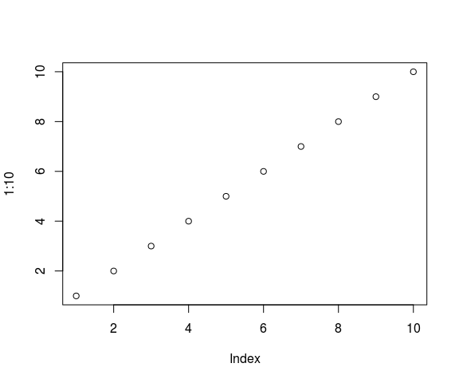

# Instalando *R* e RStudio
Jônatan Tatsch  
11-08-2015  


- - -

<p align="center">

</p>

- - -

# Introdução

O curso de Manipulação de dados meteorológicos com o R será ministrado no Labaratório Setorial de Informática (LSI) do Centro de Ciências Naturais e Exatas ([CCNE](http://w3.ufsm.br/ccne/)) da [UFSM](http://site.ufsm.br/). O LSI possui *Desktops* com sistema operacional Linux [Ubuntu](http://ubuntu-br.org/).
 
Nesse documento descreve-se como instalar o R e o [RStudio](http://www.rstudio.com/) no Linux Ubuntu.

[R](https://www.r-project.org/about.html) é uma linguagem e um ambiente de programação para computação estatística e análise de dados interativa. O *R* é um software livre, de código fonte  aberto e funciona em diversos sistemas operacionais (Linux, Windows e MacOS).

O [RStudio](http://www.rstudio.com/) é um ambiente de desenvolvimento integrado (IDE) para o *R* e será utilizado no curso.

O *R* pode ser instalado a partir dos binários pré-compilados ou do código fonte. Aqui descreve-se a instalação do *R* a partir dos binários e como configurar o Linux Ubuntu para atualizar automaticamente o *R*.


# *R* sempre atualizado

O [R](http://www.r-project.org/) é um software multiplataforma (Windows, Linux e MacOS) distribuído  na **Rede Abrangente de Arquivos do R** ([CRAN](http://cran.r-project.org/mirrors.html)). Geralmente há duas atualizações ao ano. A versão mais atual é a R version 3.2.2 (2015-08-14). Para que ele seja atualizado automaticamente no Ubuntu precisamos adicionar o [repósitório do R](http://cran.r-project.org/mirrors.html) mais próximo da nossa região à lista de repositórios do sistema. No nosso caso, o repositório mais próximo é o da UFPR (<http://cran-r.c3sl.ufpr.br/>).

## Incluindo repositório do *R* na Lista de repositórios do Ubuntu

A lista de repositórios do sistema é armazenada no arquivo `/etc/apt/sources.list`. Vamos abrir um terminal linux (use o atalho `Ctr+Alt+t`) e ver o conteúdo desse arquivo pelo seguinte comando no terminal linux:
   
~~~~~~~
$ cat /etc/apt/sources.list 
~~~~~~~

Desde o *R* as primeiras linhas desse arquivo podem ser lidas com o comando abaixo:


```
 [1] # deb cdrom:[Ubuntu 14.04.2 LTS _Trusty Tahr_ - Release amd64 (20150218.1)]/ trusty main restricted
 [2]                                                                                                    
 [3] # See http://help.ubuntu.com/community/UpgradeNotes for how to upgrade to                          
 [4] # newer versions of the distribution.                                                              
 [5] deb http://br.archive.ubuntu.com/ubuntu/ trusty main restricted                                    
 [6] deb-src http://br.archive.ubuntu.com/ubuntu/ trusty main restricted                                
 [7]                                                                                                    
 [8] ## Major bug fix updates produced after the final release of the                                   
 [9] ## distribution.                                                                                   
[10] deb http://br.archive.ubuntu.com/ubuntu/ trusty-updates main restricted                            
[11] deb-src http://br.archive.ubuntu.com/ubuntu/ trusty-updates main restricted                        
[12]                                                                                                    
[13] ## N.B. software from this repository is ENTIRELY UNSUPPORTED by the Ubuntu                        
[14] ## team. Also, please note that software in universe WILL NOT receive any                          
[15] ## review or updates from the Ubuntu security team.                                                
```

No trabalho com distribuições Linux devemos sempre preferir versões com soporte estável, nesse momento as versões de Soporte por Longo Tempo (LTS) são as 12.04 (abril de 2012, codename `precise`), 14.04 (abril de 2014, codename `trusty`) e a 15.04 (abril de 2015, codename `vivid`), você pode saber mais sobre as [versões de Ubuntu](http://releases.ubuntu.com/). Para saber qual é a versão do sistema operacional (SO) de sua PC digite na terminal linux o seguinte comando:

~~~~~~~
$ lsb_release --codename | cut -f2
~~~~~~~

Precisamos incluir no arquivo `sources.list` o repositório da UFPR. Assim o gerenciador de pacotes [apt](http://pt.wikipedia.org/wiki/Advanced_Packaging_Tool),  usado para instalação, atualização e remoção de pacotes em distribuições Debian GNU/Linux, fará a atualização do *R* quando uma nova versão estiver disponível. Ou seja, você estará utilizando sempre versão mais atual do *R*.

Vamos adicionar o endereço do repositório da UFPR na última linha do arquivo `sources.list` através de alguns comandos do linux. Essa tarefa requer privilégios de superusuário, ou seja você precisa da senha de administrador do sistema. Vamos trocar de usuário comum para super usuário desde a terminal. 

    $ sudo su

Vamos definir na terminal uma variável com o endereço do repositório.

    # repos="deb http://cran-r.c3sl.ufpr.br/bin/linux/ubuntu `lsb_release --codename | cut -f2`/"
 
Note que a variável `repos` é uma sequência de caracteres com as seguintes informações:

    deb `linkRepositorioSelecionado`/bin/linux/ubuntu `versaoUbuntu`/

A versão de Ubuntu é dada pelo comando entre crases, pode ver a linha com o comando: `$repos`, verifique se a última palavra corresponde a um dos codenames das versões Ubuntu. Para acrescentar essa informação no final do arquivo `sources.list` digite no terminal linux:

    # echo $repos >> /etc/apt/sources.list

Podemos retornar a sessão de usuário comum (*lsi*):

    # exit

## [APT protegido](https://wiki.debian.org/SecureApt) (adaptado da [CRAN](http://cran.r-project.org) seção Secure Apt).  

Os arquivos para Ubuntu na [CRAN](http://cran.r-project.org) são assinados com uma chave. Para adicionar essa chave no seu sistema digite o seguinte comando (requer senha de super usuário):

    $ gpg --keyserver hkp://keyserver.ubuntu.com:80 --recv-keys E084DAB9
        
e então use essa informação como entrada no `apt-key` com

    $ gpg -a --export E084DAB9 | sudo apt-key add -
    
Se aparecer a mensagem de que a chave pública foi importada, então não há necessidade de executar os comandos abaixo. Mas caso seja impresso alguma mensagem de erro, um método alternativo pode ser usado para obter a chave com os comandos:

    $ gpg --keyserver keyserver.ubuntu.com --recv-key E084DAB9
    $ gpg -a --export E084DAB9 | sudo apt-key add -

Se os comandos acima falharem você pode tentar:

    $ sudo apt-key adv --keyserver keyserver.ubuntu.com --recv-keys E084DAB9
    
## Atualização da lista de repositórios do Ubuntu e instalação do *R*

Após fazer as configurações da lista de repositórios e adicionar a chave é necessário fazer a atualização dessa lista (requer poderes de super usuário):

    $ sudo apt-get update
    
Agora, pode instalar o binário do R:

    $ sudo apt-get install r-base

## Local para instalação de pacotes

Para termos melhor controle sobre os pacotes do *R* instalados no sistema é recomendado criar um diretório (`/home/usuario/.R/libs`) no seu `home`. O diretório do `home` pode ser obtido com o comando `echo $HOME`.

    $ mkdir -p `echo $HOME`/.R/libs/
    
Para informar ao **R** onde procurar os pacotes que instalamos criamos um arquivo chamado `.Renviron` no diretório `$HOME` contendo a linha `R_LIBS=/home/usuario/.R/libs/`, o que pode ser feito com o  comando:

    $ echo 'R_LIBS=`echo $HOME`/.R/libs/' >> `echo $HOME`/.Renviron
    
Esse caminho fica então visível ao *R*, o que pode ser verificado executando a função `.libPaths()` a partir do console do *R*.     

## Iniciando o *R*

Para iniciar o *R* no Ubuntu, digite `R` no cursor do terminal:

    $ R

A partir desse momento já começamos uma sessão no R. Vamos gerar uma sequência de 1 a 10 e plotá-la.


```r
# sequência de 10 números
1:10
```

```
 [1]  1  2  3  4  5  6  7  8  9 10
```

```r
# gráfico
plot(1:10)
```



# RStudio no Ubuntu

O RStudio é um ambiente integrado de desenvolvimento ([IDE](http://en.wikipedia.org/wiki/Integrated_development_environment)) construído especificamente para o *R*. Existem [diversas opções de IDEs](http://www.sciviews.org/_rgui/projects/Editors.html) para o *R*. Nesse curso utilizaremos o RStudio. Assim como *R* pode ser baixado gratuitamente e é multiplataforma. O ambiente do RStudio disponibiliza o console do *R*, um editor com realce da sintaxe do *R*, ferramentas para gráficos, navegação de diretórios, manejo do espaço de trabalho, depuração de código e páginas de ajuda do *R*.

Para instalação você precisa saber seu sistema operacional e é 64 ou 32-bit. No Linux Ubuntu essa informação é obtida pelo comando linux:

    $ arch

Se retornar **x86_64** sua máquina é 64-bit.

Com essa informação, siga os seguintes passos:

  1. acesse [RStudio](http://www.rstudio.com/)
  2. clique em *Download RStudio*
  3. clique *Desktop*
  4. clique em *Download RStudio Desktop*
  5. clique sobre o link da sua plataforma, p.ex.: *RStudio x.xx.xxx - Debian 8+/Ubuntu 12.04+ (64-bit)*
  6. clique sobre o arquivo baixado com o botão direito, abra com *Ubuntu Software Center* e clique em `instalar`.

Abra o RStudio digitando no terminal:

    $ rstudio &
    
Agora você está pronto para começar a programar com *R* aproveitando as facilidades que o RStudio oferece.

# Bibliotecas Linux necessárias para alguns pacotes do R 

Para preparação dos computadores do LSI para esse curso foram instaladas algumas bibliotecas linux. Essas bibliotecas podem ser necessárias como pré-requisito de algums pacotes do R. Um exemplo desse tipo de dependência é o pacote [RGDAL](https://cran.r-project.org/web/packages/rgdal/index.html) que faz a ligação com o software (GDAL)[http://www.gdal.org/] (*Geospatial Data Abstraction Library*) possibilitando o accesso a operações de transformação/projeção da biblioteca [PROJ.4](https://en.wikipedia.org/wiki/PROJ.4). Então para usarmos o pacote [RGDAL](https://cran.r-project.org/web/packages/rgdal/index.html) é necessário a instalação das bibliotecas: `proj-bin`, `libproj-dev`, `gdal-bin`, `libgdal1-dev`.

A seguir mostra-se a forma como foi feita a instalação dessas bibliotecas LSI. Utilizaram-se comandos básicos de R e Linux facilmente executados no terminal de ambos. As bibliotecas instaladas a seguir possibilitam a ligação do R com softwares que permitem por exemplo: acesso a dados em diferentes formatos [SIG](https://pt.wikipedia.org/wiki/Sistema_de_informa%C3%A7%C3%A3o_geogr%C3%A1fica), banco de dados e a [extração de dados da web](https://en.wikipedia.org/wiki/Web_scraping), importação de dados no formato [NetCDF](https://en.wikipedia.org/wiki/NetCDF) entre outras.


Para instalação destas bibliotecas, no terminal Linux, execute os seguintes comandos:

    $ lista=`cat ~/lista_libs.txt`
    $ for i in $lista; do sudo apt-get -y install $i; done

A linguagem Java é um pré-requisito de alguns pacotes do *R* que possibilitam a animação de gráficos e o acesso a alguns banco de dados. Para instalá-lo digite (requer permissão de super usuário):

    sudo R CMD javareconf
    wget -c http://www.rforge.net/src/contrib/rJava_0.9-8.tar.gz
    R CMD INSTALL rJava_0.9-8.tar.gz

# Pacotes do R instalados para o curso

Existe uma diversidade de pacotes do *R* relacionados a Meteorologia. Alguns exemplos são os pacotes [openair](http://www.openair-project.org/) (ferramentas para análise de poluentes atmosféricos), `hydroTSM` (ferramentas para manipulação de séries hidrometeorológicas), `raster` (ferramentas análise de dados geográficos), entre outros.

Nesta seção serão instalados os pacotes do *R* importantes para aplicações em  Meteorologia. Alguns deles são utilizados nesse curso.


```r
# vetor com nome dos pacotes do R
pacotes <- c("lattice",
             "Rcpp",
             "devtools",
             "latticeExtra",
             "sfsmisc",
             "plyr",
             "dplyr",
             "tidyr",
             "openair",
             "fields",
             "RColorBrewer",
             "raster",
             "rasterVis",
             "magrittr",
             "doBy",
             "XLConnect",
             "stringr",
             "lubridate",
             "reshape2",
             "rgdal",
             "ggplot2",
             "sp",
             "maptools",
             "knitr",
             "readxl",
             "readr",
             "roxygen2",
             "httr")
# comando para instalação de pacotes
install.packages(pacotes, dependencies = T)
```


# Informações da sessão R


```r
sessionInfo()
```

```
R version 3.2.2 (2015-08-14)
Platform: x86_64-pc-linux-gnu (64-bit)
Running under: Ubuntu 14.04.3 LTS

locale:
 [1] LC_CTYPE=en_US.UTF-8       LC_NUMERIC=C              
 [3] LC_TIME=pt_BR.UTF-8        LC_COLLATE=en_US.UTF-8    
 [5] LC_MONETARY=pt_BR.UTF-8    LC_MESSAGES=en_US.UTF-8   
 [7] LC_PAPER=pt_BR.UTF-8       LC_NAME=C                 
 [9] LC_ADDRESS=C               LC_TELEPHONE=C            
[11] LC_MEASUREMENT=pt_BR.UTF-8 LC_IDENTIFICATION=C       

attached base packages:
[1] stats     graphics  grDevices utils     datasets  methods   base     

other attached packages:
[1] knitr_1.11

loaded via a namespace (and not attached):
 [1] magrittr_1.5    formatR_1.2     tools_3.2.2     htmltools_0.2.6
 [5] yaml_2.1.13     stringi_0.5-5   rmarkdown_0.7.3 stringr_1.0.0  
 [9] digest_0.6.8    evaluate_0.7.2 
```

# Lista de pacotes do R relacionados a meteorologia.

* [cmsaf](https://cran.r-project.org/web/packages/cmsaf/index.html) Tools for CM SAF Netcdf Data

* [RNCEP](https://cran.r-project.org/web/packages/RNCEP/index.html) Obtain, Organize, and Visualize NCEP Weather Data

* [clifro](https://cran.r-project.org/web/packages/clifro/index.html)	Easily Download and Visualise Climate Data from CliFlo

* [ClimClass](https://cran.r-project.org/web/packages/ClimClass/index.html)	Climate Classification According to Several Indices

* [climtrends](https://cran.r-project.org/web/packages/climtrends/index.html)	Statistical Methods for Climate Sciences

* [climwin](https://cran.r-project.org/web/packages/climwin/index.html)	Climate Window Analysis

* [comclim](https://cran.r-project.org/web/packages/comclim/index.html)	Community climate statistics

* [crn](https://cran.r-project.org/web/packages/crn/index.html)	Downloads and Builds datasets for Climate Reference Network

* [dcv](https://cran.r-project.org/web/packages/dcv/index.html)	Conventional Cross-validation statistics for climate-growth model

* [HiClimR](https://cran.r-project.org/web/packages/HiClimR/index.html)	Hierarchical Climate Regionalization

* [qmap](https://cran.r-project.org/web/packages/qmap/index.html)	Statistical transformations for post-processing climate model output

* [raincpc](https://cran.r-project.org/web/packages/raincpc/index.html)	Obtain and Analyze Rainfall Data from the Climate Prediction Center

* [rWBclimate](https://cran.r-project.org/web/packages/rWBclimate/index.html)	A package for accessing World Bank climate data

* [SCI](https://cran.r-project.org/web/packages/SCI/index.html)	Standardized Climate Indices such as SPI, SRI or SPEI

* [getMet](https://cran.r-project.org/web/packages/getMet/index.html)	Get Meteorological Data for Hydrological Modeling

* [HelpersMG](https://cran.r-project.org/web/packages/HelpersMG/index.html)	Tools for Earth Meteorological Analysis

* [meteo](https://cran.r-project.org/web/packages/meteo/index.html)	Spatio-Temporal Analysis and Mapping of 
Meteorological Observations

* [meteoForecast](https://cran.r-project.org/web/packages/meteoForecast/index.html)	Numerical Weather Predictions

* [meteogRam](https://cran.r-project.org/web/packages/meteogRam/index.html)	Tools for plotting meteograms

* [RadioSonde](https://cran.r-project.org/web/packages/RadioSonde/index.html) Tools for plotting skew-T diagrams and wind profiles

* [topmodel](https://cran.r-project.org/web/packages/topmodel/index.html)	Implementation of the hydrological model TOPMODEL in R

* [dynatopmodel](https://cran.r-project.org/web/packages/dynatopmodel/index.html)	Implementation of the Dynamic TOPMODEL hydrological model

* [waterData](https://cran.r-project.org/web/packages/waterData/index.html)	An R Package for Retrieval, Analysis, and Anomaly Calculation of Daily Hydrologic Time Series Data

* [EcoHydRology](https://cran.r-project.org/web/packages/EcoHydRology/index.html)	A community modeling foundation for Eco-Hydrology

* [hddtools](https://cran.r-project.org/web/packages/hddtools/index.html)	Hydrological Data Discovery Tools

* [hydroApps](https://cran.r-project.org/web/packages/hydroApps/index.html)	Tools and models for hydrological applications

* [hydrogeo](https://cran.r-project.org/web/packages/hydrogeo/index.html)	Groundwater data presentation and interpretation

* [hydroGOF](https://cran.r-project.org/web/packages/hydroGOF/index.html)	Goodness-of-fit functions for comparison of simulated and observed hydrological time series

* [HydroMe](https://cran.r-project.org/web/packages/HydroMe/index.html)	R codes for estimating water retention and infiltration model parameters using experimental data

* [hydrostats](https://cran.r-project.org/web/packages/hydrostats/index.html)	Hydrologic Indices for Daily Time Series Data

* [hydroTSM](https://cran.r-project.org/web/packages/hydroTSM/index.html)	Time series management, analysis and interpolation for hydrological modelling

* [precintcon](https://cran.r-project.org/web/packages/precintcon/index.html)	Precipitation Intensity, Concentration and Anomaly Analysis

* [RGENERATEPREC](https://cran.r-project.org/web/packages/RGENERATEPREC/index.html)	Tools To Generate Daily-Precipitation Time Series

* [SPEI](https://cran.r-project.org/web/packages/SPEI/index.html)	Calculation of the Standardised Precipitation-Evapotranspiration Index

* [sirad](https://cran.r-project.org/web/packages/sirad/index.html)	Functions for Calculating Daily Solar Radiation and Evapotranspiration

* [insol](https://cran.r-project.org/web/packages/insol/index.html)	Solar Radiation

* [FAOSTAT](https://cran.r-project.org/web/packages/FAOSTAT/index.html)	Download Data from the FAOSTAT Database of the Food and Agricultural Organization (FAO) of the United Nations

* [water](https://cran.r-project.org/web/packages/water/index.html)	Actual Evapotranspiration with Energy Balance Models

* [Evapotranspiration](https://cran.r-project.org/web/packages/Evapotranspiration/index.html)	Modelling Actual, Potential and Reference Crop Evapotranspiration]

* [kwb.hantush](https://cran.r-project.org/web/packages/kwb.hantush/index.html)	Calculation of Groundwater Mounding Beneath an Infiltration Basin

* [modiscloud](https://cran.r-project.org/web/packages/modiscloud/index.html)	R tools for processing Level 2 Cloud Mask products from MODIS

* [MODISTools](https://cran.r-project.org/web/packages/MODISTools/index.html)	MODIS Subsetting Tools

* [radar](https://cran.r-project.org/web/packages/radar/index.html)	Fundamental Formulas for Radar

* [timsac](https://cran.r-project.org/web/packages/timsac/index.html)	Time Series Analysis and Control package

* [TSA](https://cran.r-project.org/web/packages/TSA/index.html)	Time Series Analysis

* [ClamR](https://cran.r-project.org/web/packages/ClamR/index.html) Time Series Modeling for Climate Change Proxies

* [REddyProc](https://cran.r-project.org/web/packages/ClamR/index.html) EddyCovariance data processing and plotting utilities


# Referências

 [R](https://cran.r-project.org/bin/linux/ubuntu/README).
 
 [RStudio](http://www.rstudio.com/ide/download/desktop).
