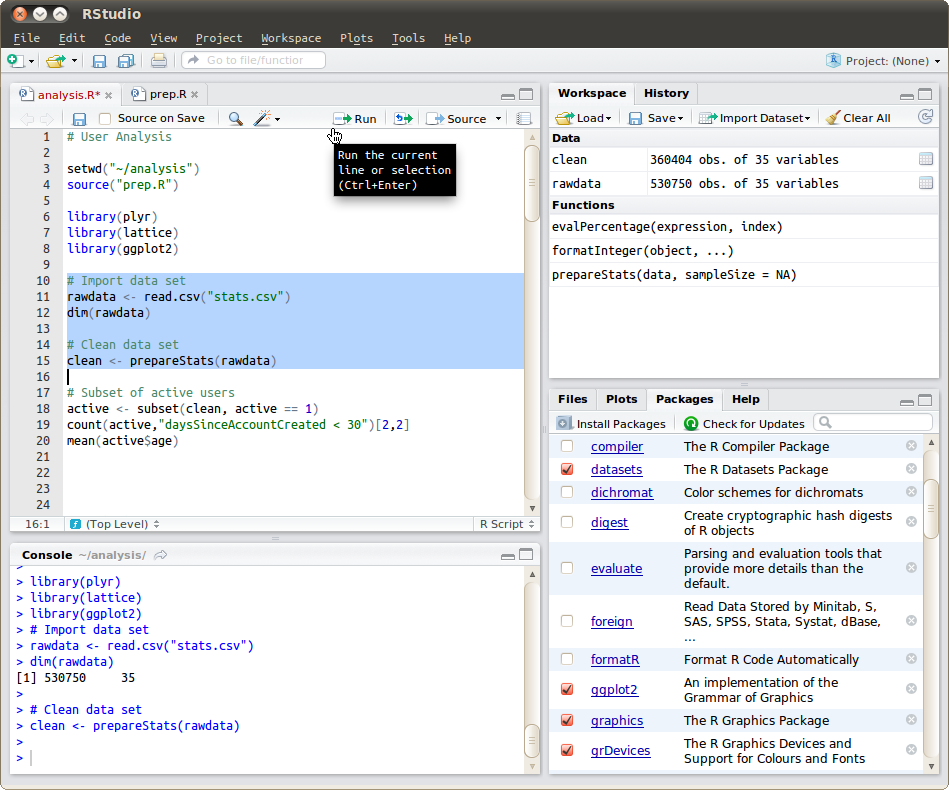
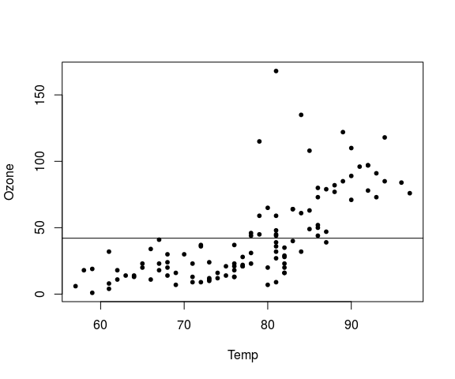
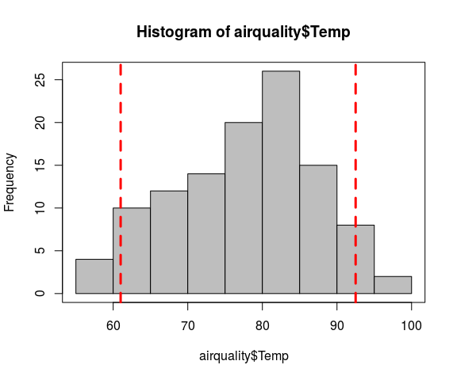
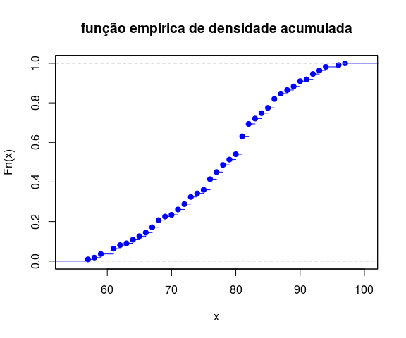
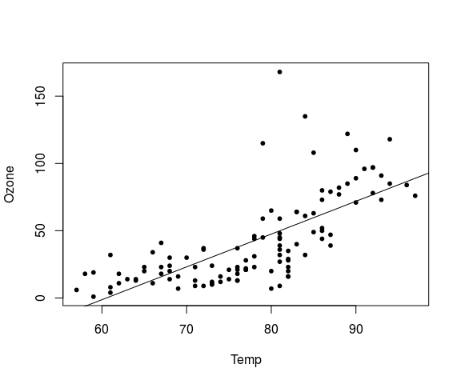
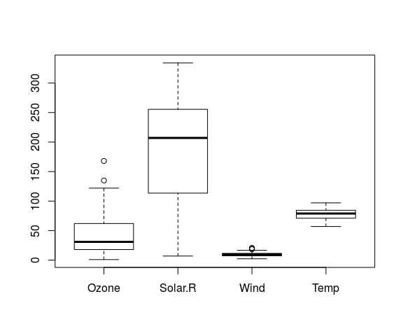

# O Essencial sobre a linguagem R
Jônatan Tatsch  
11-08-2015  


- - -

<p align="center">

</p>

- - -

# Introdução

Ao longo desse mini-curso iremos percorrer o caminho típico de uma análise básica de dados meteorológicos no R. Mas, nessa primeira etapa nós focaremos numa orientação básica sobre o R. O tema principal do curso (a diversão) começará na sessão de amanhã.

Todo o material do curso está disponível para download nesse [link](https://github.com/jdtatsch/Resbmet/archive/master.zip).

# RStudio

- Para abrir o [RStudio](https://www.rstudio.com/) no linux, digite no terminal

        $ rstudio &
<br/>
- Vamos criar um novo script (`script1.R`) para salvar as expressões que serão utilizadas nessa etapa do curso.
<br/>
<br/>
- Atalhos importante do RStudio

    - `Ctrl + <enter>`: envia comandos selecionados para execução no terminal do R
    - `Ctrl + l`: limpa tela do console do R
<br/>
<br/>

- *Tour* básico no [RStudio](https://www.rstudio.com/)



> <span style="color: red">Exercício:</span> Visualize o realce da sintaxe do R no [RStudio](https://www.rstudio.com/), copie o código desse [script](https://gist.githubusercontent.com/jdtatsch/df5fcf809362fe8825c1/raw/7642534479fb32de9e8faec1ca5a438fa572626a/get_sounding_data.R) que será aberto em seu navegador e cole-o em um novo script (denominado `get_sounding_data.R`) do [RStudio](https://www.rstudio.com/). Compare o código mostrado no navegador com o código mostrado no [RStudio](https://www.rstudio.com/)

<br/>
<br/> 
  
  
# Funcionalidade básica do R

- *prompt* do *R* (` > `) e operações aritméticas


```r
> 15 + 4
```

```
[1] 19
```

```r
> pi
```

```
[1] 3.141593
```

```r
> 60*pi/180
```

```
[1] 1.047198
```

```r
> # resto da divisao
> 10 %% 4
```

```
[1] 2
```

```r
> 2000 %% 4
```

```
[1] 0
```

```r
> 1990 %% 4
```

```
[1] 2
```

```r
> # parte inteira da divisão
> 11/2
```

```
[1] 5.5
```

```r
> 11 %/% 2
```

```
[1] 5
```

  - `#` é usado para fazer **comentários**

  - `+` indica que **continuação de uma expressão**


```r
> # COMENTÁRIO: selecione a expressão abaixo até o sinal de menos e então tecle <enter>.
> 4 -
+   
+   3
```

```
[1] 1
```

Enquanto a expressão não estiver completa o sinal de `+` se repetirá. Até que você digite o número que deseja subtrair de `4`.

 - Expressões executadas em sequência
 

```r
> 15 + 4; pi; 60*pi/180; 4-3
```

```
[1] 19
```

```
[1] 3.141593
```

```
[1] 1.047198
```

```
[1] 1
```

 - Auto preenchimento de funções


```r
read#<tab> pressione <tab> para ver as opções de comandos que iniciam com o termo read
```

 - Acesso ao histórico de expressões (no console do R, tecle a seta para cima )
 
<span style="color: red">parei aqui</span>

# Usando Funções

O R é uma *linguagem de programação funcional*. Tudo no R são funções. O valor de saída de uma função depende somente de argumentos que são entrada(s) para a função. 

A sintaxe básica de uma função segue a forma:


```r
nome_da_funcao(arg1, arg2)
```

O R possui uma série de funções internas disponíveis com a sua instalação.


```r
exp(x = 1) # neperiano ou num. de euler
```

```
[1] 2.718282
```

```r
log(10)
```

```
[1] 2.302585
```

```r
log(x = 10, base = 10)
```

```
[1] 1
```

```r
log(exp(1))
```

```
[1] 1
```

```r
seq(from = 1, to = 10, by = 0.5)
```

```
 [1]  1.0  1.5  2.0  2.5  3.0  3.5  4.0  4.5  5.0  5.5  6.0  6.5  7.0  7.5
[15]  8.0  8.5  9.0  9.5 10.0
```

```r
cos(x = 60*pi/180)
```

```
[1] 0.5
```

```r
pi
```

```
[1] 3.141593
```

```r
# arrendondamentos
round(pi, 6)
```

```
[1] 3.141593
```

```r
trunc(pi)
```

```
[1] 3
```


> Funções são identificadas por serem precedidas de parênteses.

# Criando e manipulando objetos do R

Atribuição de valores a variáveis.


```r
# criando variável
n <- 5
n
```

```
[1] 5
```

```r
ls()
```

```
[1] "n"
```

```r
# removendo a variável n
rm(n)
ls()
```

```
character(0)
```

Existem diversos tipo de objetos no R, mas os mais comuns são `numeric` e `character`.


```r
# colocando a expressão entre parênteses já imprime o resultado no console
(num <- 3.14) 
```

```
[1] 3.14
```

```r
(char <- "VI encontro sul brasileiro de meteorologia")
```

```
[1] "VI encontro sul brasileiro de meteorologia"
```

```r
(trimestres <- c("DJF", "MAM", "JJA", "SON"))
```

```
[1] "DJF" "MAM" "JJA" "SON"
```

## Vetores


```r
# criam-se vetores concatenando 'c()' valores
vetor <- c(2,5,8,3,7)
# sequencia
(vetor <- 10:20)
```

```
 [1] 10 11 12 13 14 15 16 17 18 19 20
```

```r
# tamanho do vetor
length(vetor)
```

```
[1] 11
```

Vetores podem acessados de várias formas usando colchetes `[ ]`.


```r
# selecionando 3o elemento do vetor
vetor[3]
```

```
[1] 12
```

```r
# o vetor sem a 1a posição
vetor[-1]
```

```
 [1] 11 12 13 14 15 16 17 18 19 20
```

```r
# o vetor sem a última posição
vetor[-length(vetor)]
```

```
 [1] 10 11 12 13 14 15 16 17 18 19
```

```r
# selecionando do 3o ao 6o elemento do vetor
vetor[3:6]
```

```
[1] 12 13 14 15
```

```r
# selecionando o 1o, 3o e 8o elemento do vetor
vetor[c(1,3,8)]
```

```
[1] 10 12 17
```

```r
# teste lógico
vetor > 15
```

```
 [1] FALSE FALSE FALSE FALSE FALSE FALSE  TRUE  TRUE  TRUE  TRUE  TRUE
```

```r
# seleção de elementos do vetor usando vetor lógico
vetor[vetor > 15]
```

```
[1] 16 17 18 19 20
```

```r
vetor[c(TRUE, FALSE)]
```

```
[1] 10 12 14 16 18 20
```

```r
vetor
```

```
 [1] 10 11 12 13 14 15 16 17 18 19 20
```

```r
vetor[c(FALSE, FALSE, TRUE)]
```

```
[1] 12 15 18
```

## Vetores lógicos (verdadeiro ou falso?)

Verificando se um vetor contém um valor.


```r
5 %in% vetor
```

```
[1] FALSE
```

```r
12 %in% vetor
```

```
[1] TRUE
```

```r
c(5, 12) %in% vetor
```

```
[1] FALSE  TRUE
```

```r
# verificando se o vetor contém alguns valores
vetor %in% c(11, 19)
```

```
 [1] FALSE  TRUE FALSE FALSE FALSE FALSE FALSE FALSE FALSE  TRUE FALSE
```

Encontrando a posição dos valores contidos no vetor.


```r
which(vetor %in% c(11, 19))
```

```
[1]  2 10
```

```r
which(vetor == 11)
```

```
[1] 2
```

```r
which(vetor != 11)
```

```
 [1]  1  3  4  5  6  7  8  9 10 11
```

```r
vetor[which(vetor != 11)]
```

```
 [1] 10 12 13 14 15 16 17 18 19 20
```

```r
# vetor de horas
(horas <- c(0:23, 0:23))
```

```
 [1]  0  1  2  3  4  5  6  7  8  9 10 11 12 13 14 15 16 17 18 19 20 21 22
[24] 23  0  1  2  3  4  5  6  7  8  9 10 11 12 13 14 15 16 17 18 19 20 21
[47] 22 23
```

```r
# vetor lógico indicando se é noite
eh_noite <- horas > 18 | horas < 6
# posicoes do vetor horas que correspondem a noite
pos_noturna <- which(eh_noite)
# posicoes do vetor horas que correspondem a noite
#eh_dia <- horas <= 18 & horas >= 6
eh_dia <- !eh_noite
pos_dia <- which(eh_dia)
```


----------------------------------
 Operador         Descrição       
---------- -----------------------
    <             menor que       

    <=        menor ou igual a    

    >             maior que       

    >=         maior ou igual     

    ==            idêntico        

    !=            diferente       

    !x        não é x (negação)   

  x | y            x ou y         

  x & y             x e y         

isTRUE(x)  teste se x é verdadeiro

   %in%        está contido em    
----------------------------------

Table: Tabela 1. Operadores Lógicos

### Sequências e repetições


```r
## horas
h <- 0:23
length(h)
```

```
[1] 24
```

```r
# meia-horas
mh <- seq(0, 23, by = 0.5)
length(mh)
```

```
[1] 47
```

```r
# 24 horas dividas igualmente em 10 pontos
h10 <- seq(0, 23, length.out = 10)
length(h10)
```

```
[1] 10
```

```r
# repetição de números
(rep1 <- rep(1:2, times = 4))
```

```
[1] 1 2 1 2 1 2 1 2
```

```r
(rep2 <- rep(1:2, each = 4))
```

```
[1] 1 1 1 1 2 2 2 2
```

```r
(rep_t13 <- rep(c("chuva","sol"), times = c(1,3)))
```

```
[1] "chuva" "sol"   "sol"   "sol"  
```

```r
(rep_t13_t4 <- rep(rep(c("chuva","sol"), 
                       times = c(1,3)), 
                   times = 4))
```

```
 [1] "chuva" "sol"   "sol"   "sol"   "chuva" "sol"   "sol"   "sol"  
 [9] "chuva" "sol"   "sol"   "sol"   "chuva" "sol"   "sol"   "sol"  
```

### Lidando com dados faltantes

**NA: Not Available**


```r
# criando vetor com dados faltantes
(x <- 1:5)
```

```
[1] 1 2 3 4 5
```

```r
x[8] <- 8
x[3] <- NA
print(x)
```

```
[1]  1  2 NA  4  5 NA NA  8
```

```r
# onde há dados faltantes
is.na(x)
```

```
[1] FALSE FALSE  TRUE FALSE FALSE  TRUE  TRUE FALSE
```

```r
# valores dos elementos válidos?
x[!is.na(x)]
```

```
[1] 1 2 4 5 8
```


## Matrizes

Matriz é um vetor de 2 dimensões (linas e colunas) com mesmo tipo de dados.


```r
(mat <- matrix(data = 1:15, nrow = 3, ncol = 5))
```

```
     [,1] [,2] [,3] [,4] [,5]
[1,]    1    4    7   10   13
[2,]    2    5    8   11   14
[3,]    3    6    9   12   15
```

```r
# transposta da mat
t(mat)
```

```
     [,1] [,2] [,3]
[1,]    1    2    3
[2,]    4    5    6
[3,]    7    8    9
[4,]   10   11   12
[5,]   13   14   15
```

```r
(mat1 <- matrix(data = 1:15, nrow = 3, ncol = 5, byrow = TRUE))
```

```
     [,1] [,2] [,3] [,4] [,5]
[1,]    1    2    3    4    5
[2,]    6    7    8    9   10
[3,]   11   12   13   14   15
```

```r
# convertendo matriz para vetor
c(mat)
```

```
 [1]  1  2  3  4  5  6  7  8  9 10 11 12 13 14 15
```

```r
# convertenoo matriz para vetor seguindo as linhas
c(t(mat1))
```

```
 [1]  1  2  3  4  5  6  7  8  9 10 11 12 13 14 15
```

```r
# operações lógicas também funcionam com matrizes
mat1 > 5
```

```
      [,1]  [,2]  [,3]  [,4]  [,5]
[1,] FALSE FALSE FALSE FALSE FALSE
[2,]  TRUE  TRUE  TRUE  TRUE  TRUE
[3,]  TRUE  TRUE  TRUE  TRUE  TRUE
```

Informações sobre a estrutura da matriz.


```r
# num. de linhas da matriz
nrow(mat)
```

```
[1] 3
```

```r
# num. de colunas
ncol(mat)
```

```
[1] 5
```

```r
# num. de elementos
ncol(mat) * nrow(mat)
```

```
[1] 15
```

```r
# classe dos dados
class(mat)
```

```
[1] "matrix"
```

```r
# modo (numeric, character, logical)
mode(mat)
```

```
[1] "numeric"
```

Para aplicar uma função a cada linha (coluna) de uma `matrix` podemos usar-se a função `apply()` da família `*apply()`, por exemplo:


```r
mat
```

```
     [,1] [,2] [,3] [,4] [,5]
[1,]    1    4    7   10   13
[2,]    2    5    8   11   14
[3,]    3    6    9   12   15
```

```r
# margin = 1, para operação ser realizada so longo das linhas
# margin = 2, para operação ser realizada so longo das colunas
(mat_max_lin <- apply(X = mat, MARGIN = 1, FUN = max))
```

```
[1] 13 14 15
```

```r
(mat_max_col <- apply(X = mat, MARGIN = 2, FUN = max))
```

```
[1]  3  6  9 12 15
```

Existe um conjunto de funções próprias e eficientes para uso em matrizes, como:


```r
rowSums(mat)
```

```
[1] 35 40 45
```

```r
colSums(mat)
```

```
[1]  6 15 24 33 42
```

```r
rowMeans(mat)
```

```
[1] 7 8 9
```

```r
colMeans(mat)
```

```
[1]  2  5  8 11 14
```

## Data frame 

Um data frame é como uma matriz mas é capaz de acomodar campos (colunas) com diferentes tipos de dados. Cada linha do `data-frame` corresponde a um registro da tabela e cada coluna corresponde ao registro de uma variável na tabela.


```r
## criando um dataframe
dados <- data.frame(dates = c("2013-01-01", "2013-01-02", "2013-01-03", "2013-01-04", "2013-01-05", 
                                 "2013-01-06", "2013-01-07", "2013-01-08", "2013-01-09", "2013-01-10", 
                                 "2013-01-11", "2013-01-12", "2013-01-13", "2013-01-14", "2013-01-15"), 
                       cidade = rep("Santa Maria", 15),    
                       tar = c(31, 35, 21, 23, 33, 17, 18, 16, 34, 27, 15, 28, 22, 29, 32), stringsAsFactors = FALSE)  
dados
```

```
        dates      cidade tar
1  2013-01-01 Santa Maria  31
2  2013-01-02 Santa Maria  35
3  2013-01-03 Santa Maria  21
4  2013-01-04 Santa Maria  23
5  2013-01-05 Santa Maria  33
6  2013-01-06 Santa Maria  17
7  2013-01-07 Santa Maria  18
8  2013-01-08 Santa Maria  16
9  2013-01-09 Santa Maria  34
10 2013-01-10 Santa Maria  27
11 2013-01-11 Santa Maria  15
12 2013-01-12 Santa Maria  28
13 2013-01-13 Santa Maria  22
14 2013-01-14 Santa Maria  29
15 2013-01-15 Santa Maria  32
```

```r
class(dados)
```

```
[1] "data.frame"
```


Data frame pode ser facilmente visualizados:

```r
View(dados)
```

Examine a estrutura interna de um dataframe

```r
str(dados)
```

```
'data.frame':	15 obs. of  3 variables:
 $ dates : chr  "2013-01-01" "2013-01-02" "2013-01-03" "2013-01-04" ...
 $ cidade: chr  "Santa Maria" "Santa Maria" "Santa Maria" "Santa Maria" ...
 $ tar   : num  31 35 21 23 33 17 18 16 34 27 ...
```

### Seleção de partes de um data frame


```r
# por números
dados[1,]
```

```
       dates      cidade tar
1 2013-01-01 Santa Maria  31
```

```r
dados[2:3,]
```

```
       dates      cidade tar
2 2013-01-02 Santa Maria  35
3 2013-01-03 Santa Maria  21
```

```r
dados[,1]
```

```
 [1] "2013-01-01" "2013-01-02" "2013-01-03" "2013-01-04" "2013-01-05"
 [6] "2013-01-06" "2013-01-07" "2013-01-08" "2013-01-09" "2013-01-10"
[11] "2013-01-11" "2013-01-12" "2013-01-13" "2013-01-14" "2013-01-15"
```

```r
dados[2,1]
```

```
[1] "2013-01-02"
```

```r
# por nomes
dados$tar
```

```
 [1] 31 35 21 23 33 17 18 16 34 27 15 28 22 29 32
```

```r
dados$tar[2:4]
```

```
[1] 35 21 23
```

```r
dados[, "tar"]
```

```
 [1] 31 35 21 23 33 17 18 16 34 27 15 28 22 29 32
```

```r
dados[2:4, "tar"]
```

```
[1] 35 21 23
```

```r
dados["dates"]
```

```
        dates
1  2013-01-01
2  2013-01-02
3  2013-01-03
4  2013-01-04
5  2013-01-05
6  2013-01-06
7  2013-01-07
8  2013-01-08
9  2013-01-09
10 2013-01-10
11 2013-01-11
12 2013-01-12
13 2013-01-13
14 2013-01-14
15 2013-01-15
```

```r
class(dados["dates"])
```

```
[1] "data.frame"
```

```r
is.vector(dados["dates"])
```

```
[1] FALSE
```

```r
dados[["dates"]]
```

```
 [1] "2013-01-01" "2013-01-02" "2013-01-03" "2013-01-04" "2013-01-05"
 [6] "2013-01-06" "2013-01-07" "2013-01-08" "2013-01-09" "2013-01-10"
[11] "2013-01-11" "2013-01-12" "2013-01-13" "2013-01-14" "2013-01-15"
```

```r
is.vector(dados[["dates"]])
```

```
[1] TRUE
```

Data frames podem ter nomes associados às colunas e linhas.


```r
colnames(dados)  
```

```
[1] "dates"  "cidade" "tar"   
```

```r
names(dados)     # apenas para dataframes
```

```
[1] "dates"  "cidade" "tar"   
```

```r
rownames(dados)
```

```
 [1] "1"  "2"  "3"  "4"  "5"  "6"  "7"  "8"  "9"  "10" "11" "12" "13" "14"
[15] "15"
```

```r
# nomes podem ser alterados
names(dados) <- c("data", "municipio", "temp")
dados
```

```
         data   municipio temp
1  2013-01-01 Santa Maria   31
2  2013-01-02 Santa Maria   35
3  2013-01-03 Santa Maria   21
4  2013-01-04 Santa Maria   23
5  2013-01-05 Santa Maria   33
6  2013-01-06 Santa Maria   17
7  2013-01-07 Santa Maria   18
8  2013-01-08 Santa Maria   16
9  2013-01-09 Santa Maria   34
10 2013-01-10 Santa Maria   27
11 2013-01-11 Santa Maria   15
12 2013-01-12 Santa Maria   28
13 2013-01-13 Santa Maria   22
14 2013-01-14 Santa Maria   29
15 2013-01-15 Santa Maria   32
```

### Subconjunto de um data frame e filtragem 


```r
dados[dados$temp==28, ]                 # uma condição
```

```
         data   municipio temp
12 2013-01-12 Santa Maria   28
```

```r
dados[dados$data %in% c("2013-01-10", "2013-01-13"),]   # mais de uma condição
```

```
         data   municipio temp
10 2013-01-10 Santa Maria   27
13 2013-01-13 Santa Maria   22
```

### Adicionando novas linas e colunas


```r
(nova_linha <- data.frame(data="2013-01-15", municipio="São Sepé", temp = 10))
```

```
        data municipio temp
1 2013-01-15  São Sepé   10
```

```r
# cola linha
(dados <- rbind(dados, nova_linha))
```

```
         data   municipio temp
1  2013-01-01 Santa Maria   31
2  2013-01-02 Santa Maria   35
3  2013-01-03 Santa Maria   21
4  2013-01-04 Santa Maria   23
5  2013-01-05 Santa Maria   33
6  2013-01-06 Santa Maria   17
7  2013-01-07 Santa Maria   18
8  2013-01-08 Santa Maria   16
9  2013-01-09 Santa Maria   34
10 2013-01-10 Santa Maria   27
11 2013-01-11 Santa Maria   15
12 2013-01-12 Santa Maria   28
13 2013-01-13 Santa Maria   22
14 2013-01-14 Santa Maria   29
15 2013-01-15 Santa Maria   32
16 2013-01-15    São Sepé   10
```

```r
(nova_coluna <- data.frame(tmin = sort(dados$temp)-5))
```

```
   tmin
1     5
2    10
3    11
4    12
5    13
6    16
7    17
8    18
9    22
10   23
11   24
12   26
13   27
14   28
15   29
16   30
```

```r
# cola coluna
(dados <- cbind(dados, nova_coluna))
```

```
         data   municipio temp tmin
1  2013-01-01 Santa Maria   31    5
2  2013-01-02 Santa Maria   35   10
3  2013-01-03 Santa Maria   21   11
4  2013-01-04 Santa Maria   23   12
5  2013-01-05 Santa Maria   33   13
6  2013-01-06 Santa Maria   17   16
7  2013-01-07 Santa Maria   18   17
8  2013-01-08 Santa Maria   16   18
9  2013-01-09 Santa Maria   34   22
10 2013-01-10 Santa Maria   27   23
11 2013-01-11 Santa Maria   15   24
12 2013-01-12 Santa Maria   28   26
13 2013-01-13 Santa Maria   22   27
14 2013-01-14 Santa Maria   29   28
15 2013-01-15 Santa Maria   32   29
16 2013-01-15    São Sepé   10   30
```


<span style="color: red">Fim da aula do 1º dia.</span>

### Examinando data frames

Quando trabalhamos com grandes dataframes a visualização dos dados como um todo pode ser inviável. A alternativa nesse caso é usar as funções apresentadas no trecho de código abaixo:


```r
# linhas iniciais do dataframe
head(dados)
```

```
        data   municipio temp tmin
1 2013-01-01 Santa Maria   31    5
2 2013-01-02 Santa Maria   35   10
3 2013-01-03 Santa Maria   21   11
4 2013-01-04 Santa Maria   23   12
5 2013-01-05 Santa Maria   33   13
6 2013-01-06 Santa Maria   17   16
```

```r
# linhas finais do dataframe
tail(dados)
```

```
         data   municipio temp tmin
11 2013-01-11 Santa Maria   15   24
12 2013-01-12 Santa Maria   28   26
13 2013-01-13 Santa Maria   22   27
14 2013-01-14 Santa Maria   29   28
15 2013-01-15 Santa Maria   32   29
16 2013-01-15    São Sepé   10   30
```

```r
# últimos duas linhas do dataframe
tail(dados, 2)
```

```
         data   municipio temp tmin
15 2013-01-15 Santa Maria   32   29
16 2013-01-15    São Sepé   10   30
```

```r
# A mais importante: resumo da estrutura dos dados
str(dados)
```

```
'data.frame':	16 obs. of  4 variables:
 $ data     : chr  "2013-01-01" "2013-01-02" "2013-01-03" "2013-01-04" ...
 $ municipio: chr  "Santa Maria" "Santa Maria" "Santa Maria" "Santa Maria" ...
 $ temp     : num  31 35 21 23 33 17 18 16 34 27 ...
 $ tmin     : num  5 10 11 12 13 16 17 18 22 23 ...
```

## Listas

Estrutura de dados muito versátil por pelo menos 3 razões:

  1. Os elementos podem ser de diferentes classes de objetos (p.ex.: um elemento `numeric`, outro `character`);
  2. Cada elemento pode ter um tamanho diferente;
  3. Os elementos podem conter diferentes estrutura de dados (p.ex.: um elemento `matrix`, outro `vector`);

Listas podem ser criadas com a função `list()`. A especificação do conteúdo de uma lista é muito similar a da função `c()` vista anteriormente. Nós simplemente listamos os elementos da lista separados por uma vírgula dentro da função `list()`.


```r
## lista de dados heterogêneos
lst <- list(1:4, c(1.1, 2.3, 5.9), c(TRUE, FALSE), "R", list(0,1), dados[1:4, ])
lst
```

```
[[1]]
[1] 1 2 3 4

[[2]]
[1] 1.1 2.3 5.9

[[3]]
[1]  TRUE FALSE

[[4]]
[1] "R"

[[5]]
[[5]][[1]]
[1] 0

[[5]][[2]]
[1] 1


[[6]]
        data   municipio temp tmin
1 2013-01-01 Santa Maria   31    5
2 2013-01-02 Santa Maria   35   10
3 2013-01-03 Santa Maria   21   11
4 2013-01-04 Santa Maria   23   12
```

```r
## estrutura da lista
str(lst)
```

```
List of 6
 $ : int [1:4] 1 2 3 4
 $ : num [1:3] 1.1 2.3 5.9
 $ : logi [1:2] TRUE FALSE
 $ : chr "R"
 $ :List of 2
  ..$ : num 0
  ..$ : num 1
 $ :'data.frame':	4 obs. of  4 variables:
  ..$ data     : chr [1:4] "2013-01-01" "2013-01-02" "2013-01-03" "2013-01-04"
  ..$ municipio: chr [1:4] "Santa Maria" "Santa Maria" "Santa Maria" "Santa Maria"
  ..$ temp     : num [1:4] 31 35 21 23
  ..$ tmin     : num [1:4] 5 10 11 12
```

```r
## tamanho da lista (num. de componentes ou elementos)
length(lst)
```

```
[1] 6
```

```r
## atribuindo nomes a lista
names(lst) 
```

```
NULL
```

```r
names(lst) <- c("vetor_int", "vetor_num", "logico", "char", "lista", "df")
lst
```

```
$vetor_int
[1] 1 2 3 4

$vetor_num
[1] 1.1 2.3 5.9

$logico
[1]  TRUE FALSE

$char
[1] "R"

$lista
$lista[[1]]
[1] 0

$lista[[2]]
[1] 1


$df
        data   municipio temp tmin
1 2013-01-01 Santa Maria   31    5
2 2013-01-02 Santa Maria   35   10
3 2013-01-03 Santa Maria   21   11
4 2013-01-04 Santa Maria   23   12
```

Acesso as componentes das lista:


```r
# extraindo dados
# colchetes duplos significam que o objeto retornado é da classe de dados do item da lista
lst[[1]]      
```

```
[1] 1 2 3 4
```

```r
# o nome da componente também pode ser usada para extração
lst[["vetor_int"]]
```

```
[1] 1 2 3 4
```

```r
# a selecionando mais que 1 item da lista é possível com colchetes simples
lst[2:3]
```

```
$vetor_num
[1] 1.1 2.3 5.9

$logico
[1]  TRUE FALSE
```

```r
# mas o objeto retornado é uma lista
lst[c(1,3)]
```

```
$vetor_int
[1] 1 2 3 4

$logico
[1]  TRUE FALSE
```

```r
lst[c("vetor_int","logico")]
```

```
$vetor_int
[1] 1 2 3 4

$logico
[1]  TRUE FALSE
```

```r
is.list(lst[c(1,3)])
```

```
[1] TRUE
```

```r
# deletetando itens de uma lista
lst[[3]] <- NULL
str(lst)
```

```
List of 5
 $ vetor_int: int [1:4] 1 2 3 4
 $ vetor_num: num [1:3] 1.1 2.3 5.9
 $ char     : chr "R"
 $ lista    :List of 2
  ..$ : num 0
  ..$ : num 1
 $ df       :'data.frame':	4 obs. of  4 variables:
  ..$ data     : chr [1:4] "2013-01-01" "2013-01-02" "2013-01-03" "2013-01-04"
  ..$ municipio: chr [1:4] "Santa Maria" "Santa Maria" "Santa Maria" "Santa Maria"
  ..$ temp     : num [1:4] 31 35 21 23
  ..$ tmin     : num [1:4] 5 10 11 12
```

```r
lst[1:2] <- NULL
str(lst)
```

```
List of 3
 $ char : chr "R"
 $ lista:List of 2
  ..$ : num 0
  ..$ : num 1
 $ df   :'data.frame':	4 obs. of  4 variables:
  ..$ data     : chr [1:4] "2013-01-01" "2013-01-02" "2013-01-03" "2013-01-04"
  ..$ municipio: chr [1:4] "Santa Maria" "Santa Maria" "Santa Maria" "Santa Maria"
  ..$ temp     : num [1:4] 31 35 21 23
  ..$ tmin     : num [1:4] 5 10 11 12
```

Outro exemplo de uso de uma lista é quando os dados que trabalhamos possuem tamanhos diferentes.


```r
(dados_l <- list(c(1, 2, 3), 3:7, 10:5, 12:5))
```

```
[[1]]
[1] 1 2 3

[[2]]
[1] 3 4 5 6 7

[[3]]
[1] 10  9  8  7  6  5

[[4]]
[1] 12 11 10  9  8  7  6  5
```

Para aplicar uma função a cada elemento da lista podemos usar-se as funções da família `*apply()`, por exemplo:


```r
# lapply ---> resultado é uma "l"ista
(med_dl_l <- lapply(dados_l, mean))
```

```
[[1]]
[1] 2

[[2]]
[1] 5

[[3]]
[1] 7.5

[[4]]
[1] 8.5
```

```r
# sapply ---> resultado é um objeto "s"implificado (vetor ou matrizes)
(med_dl_s <- sapply(dados_l, mean))
```

```
[1] 2.0 5.0 7.5 8.5
```

Observe que as funções da família `*apply` são essencialmente *loopings* ou laço.

# Dados de pacotes do R

O `R` possui diversos conjuntos de dados internos que são automaticamente carregados quando iniciado. Esses dados são usados nos exemplos do `help()` de diversas funções para ilustrar o uso e a aplicação delas. Esses dados podem ser carregados com a função `data`.


```r
data()
## Annual Precipitation in US Cities, p/ mais informações "?precip"
data(precip)
## primeiros 30 elementos dos dados precip
head(precip, n = 30)
```

```
             Mobile              Juneau             Phoenix 
               67.0                54.7                 7.0 
        Little Rock         Los Angeles          Sacramento 
               48.5                14.0                17.2 
      San Francisco              Denver            Hartford 
               20.7                13.0                43.4 
         Wilmington          Washington        Jacksonville 
               40.2                38.9                54.5 
              Miami             Atlanta            Honolulu 
               59.8                48.3                22.9 
              Boise             Chicago              Peoria 
               11.5                34.4                35.1 
       Indianapolis          Des Moines             Wichita 
               38.7                30.8                30.6 
         Louisville         New Orleans            Portland 
               43.1                56.8                40.8 
          Baltimore              Boston             Detroit 
               41.8                42.5                31.0 
   Sault Ste. Marie              Duluth Minneapolis/St Paul 
               31.7                30.2                25.9 
```

```r
## New York Air Quality Measurements, , p/ mais informações "?airquality"
data(airquality)
## primeiras linhas dos dados
head(airquality, n = 10)
```

```
   Ozone Solar.R Wind Temp Month Day
1     41     190  7.4   67     5   1
2     36     118  8.0   72     5   2
3     12     149 12.6   74     5   3
4     18     313 11.5   62     5   4
5     NA      NA 14.3   56     5   5
6     28      NA 14.9   66     5   6
7     23     299  8.6   65     5   7
8     19      99 13.8   59     5   8
9      8      19 20.1   61     5   9
10    NA     194  8.6   69     5  10
```

# Funções estatísticas básicas


```r
# carregando data frame "New York Air Quality Measurements" do pacote datasets
data("airquality")
# ?airquality
str(airquality)
```

```
'data.frame':	153 obs. of  6 variables:
 $ Ozone  : int  41 36 12 18 NA 28 23 19 8 NA ...
 $ Solar.R: int  190 118 149 313 NA NA 299 99 19 194 ...
 $ Wind   : num  7.4 8 12.6 11.5 14.3 14.9 8.6 13.8 20.1 8.6 ...
 $ Temp   : int  67 72 74 62 56 66 65 59 61 69 ...
 $ Month  : int  5 5 5 5 5 5 5 5 5 5 ...
 $ Day    : int  1 2 3 4 5 6 7 8 9 10 ...
```

```r
summary(airquality)
```

```
     Ozone           Solar.R           Wind             Temp      
 Min.   :  1.00   Min.   :  7.0   Min.   : 1.700   Min.   :56.00  
 1st Qu.: 18.00   1st Qu.:115.8   1st Qu.: 7.400   1st Qu.:72.00  
 Median : 31.50   Median :205.0   Median : 9.700   Median :79.00  
 Mean   : 42.13   Mean   :185.9   Mean   : 9.958   Mean   :77.88  
 3rd Qu.: 63.25   3rd Qu.:258.8   3rd Qu.:11.500   3rd Qu.:85.00  
 Max.   :168.00   Max.   :334.0   Max.   :20.700   Max.   :97.00  
 NA's   :37       NA's   :7                                       
     Month            Day      
 Min.   :5.000   Min.   : 1.0  
 1st Qu.:6.000   1st Qu.: 8.0  
 Median :7.000   Median :16.0  
 Mean   :6.993   Mean   :15.8  
 3rd Qu.:8.000   3rd Qu.:23.0  
 Max.   :9.000   Max.   :31.0  
                               
```

```r
# removendo qualquer linha dos dados com dados faltantes
complete.cases(airquality)
```

```
  [1]  TRUE  TRUE  TRUE  TRUE FALSE FALSE  TRUE  TRUE  TRUE FALSE FALSE
 [12]  TRUE  TRUE  TRUE  TRUE  TRUE  TRUE  TRUE  TRUE  TRUE  TRUE  TRUE
 [23]  TRUE  TRUE FALSE FALSE FALSE  TRUE  TRUE  TRUE  TRUE FALSE FALSE
 [34] FALSE FALSE FALSE FALSE  TRUE FALSE  TRUE  TRUE FALSE FALSE  TRUE
 [45] FALSE FALSE  TRUE  TRUE  TRUE  TRUE  TRUE FALSE FALSE FALSE FALSE
 [56] FALSE FALSE FALSE FALSE FALSE FALSE  TRUE  TRUE  TRUE FALSE  TRUE
 [67]  TRUE  TRUE  TRUE  TRUE  TRUE FALSE  TRUE  TRUE FALSE  TRUE  TRUE
 [78]  TRUE  TRUE  TRUE  TRUE  TRUE FALSE FALSE  TRUE  TRUE  TRUE  TRUE
 [89]  TRUE  TRUE  TRUE  TRUE  TRUE  TRUE  TRUE FALSE FALSE FALSE  TRUE
[100]  TRUE  TRUE FALSE FALSE  TRUE  TRUE  TRUE FALSE  TRUE  TRUE  TRUE
[111]  TRUE  TRUE  TRUE  TRUE FALSE  TRUE  TRUE  TRUE FALSE  TRUE  TRUE
[122]  TRUE  TRUE  TRUE  TRUE  TRUE  TRUE  TRUE  TRUE  TRUE  TRUE  TRUE
[133]  TRUE  TRUE  TRUE  TRUE  TRUE  TRUE  TRUE  TRUE  TRUE  TRUE  TRUE
[144]  TRUE  TRUE  TRUE  TRUE  TRUE  TRUE FALSE  TRUE  TRUE  TRUE
```

```r
airquality <- airquality[complete.cases(airquality), ]
summary(airquality)
```

```
     Ozone          Solar.R           Wind            Temp      
 Min.   :  1.0   Min.   :  7.0   Min.   : 2.30   Min.   :57.00  
 1st Qu.: 18.0   1st Qu.:113.5   1st Qu.: 7.40   1st Qu.:71.00  
 Median : 31.0   Median :207.0   Median : 9.70   Median :79.00  
 Mean   : 42.1   Mean   :184.8   Mean   : 9.94   Mean   :77.79  
 3rd Qu.: 62.0   3rd Qu.:255.5   3rd Qu.:11.50   3rd Qu.:84.50  
 Max.   :168.0   Max.   :334.0   Max.   :20.70   Max.   :97.00  
     Month            Day       
 Min.   :5.000   Min.   : 1.00  
 1st Qu.:6.000   1st Qu.: 9.00  
 Median :7.000   Median :16.00  
 Mean   :7.216   Mean   :15.95  
 3rd Qu.:9.000   3rd Qu.:22.50  
 Max.   :9.000   Max.   :31.00  
```

```r
# gráfico de dispersão entre Ozônio e temperatura do ar
with(airquality, plot(Temp, Ozone, pch = 20))
abline(h = mean(airquality$Ozone, na.rm = TRUE))
```

 

```r
# esttísticas de algumas variáveis
sd(airquality$Temp)
```

```
[1] 9.529969
```

```r
range(airquality$Ozone)
```

```
[1]   1 168
```

```r
qs <- quantile(airquality$Temp, c(0.05, 0.95))
# histograma
hist(airquality$Temp, col = "gray"); box()
abline(v = qs, col = 2, lwd = 3, lty =2)
```

 

```r
with(airquality, cor(Temp, Ozone, use = "complete.obs"))
```

```
[1] 0.6985414
```

```r
# FEDA
plot(ecdf(airquality$Temp), col = "blue", main = "função empírica de densidade acumulada"); box()
```

 

```r
# reordena o vetor
head(airquality$Ozone, 20)
```

```
 [1] 41 36 12 18 23 19  8 16 11 14 18 14 34  6 30 11  1 11  4 32
```

```r
head(sort(airquality$Ozone), 20)
```

```
 [1]  1  4  6  7  7  8  9  9  9 10 11 11 11 12 12 13 13 13 13 14
```

```r
head(o <- order(airquality$Ozone), 20)
```

```
 [1]  17  19  14  45 106   7  61  75  96  43   9  16  18   3  32  33  97
[18] 100 103  10
```

```r
#plot(airquality$Ozone[o])
# ordenando dataframe pela Temp
head(airquality[o, ], 20)
```

```
    Ozone Solar.R Wind Temp Month Day
21      1       8  9.7   59     5  21
23      4      25  9.7   61     5  23
18      6      78 18.4   57     5  18
76      7      48 14.3   80     7  15
147     7      49 10.3   69     9  24
9       8      19 20.1   61     5   9
94      9      24 13.8   81     8   2
114     9      36 14.3   72     8  22
137     9      24 10.9   71     9  14
73     10     264 14.3   73     7  12
13     11     290  9.2   66     5  13
20     11      44  9.7   62     5  20
22     11     320 16.6   73     5  22
3      12     149 12.6   74     5   3
50     12     120 11.5   73     6  19
51     13     137 10.3   76     6  20
138    13     112 11.5   71     9  15
141    13      27 10.3   76     9  18
144    13     238 12.6   64     9  21
14     14     274 10.9   68     5  14
```

### Regressão linear e gráficos 


```r
# regressão linear
(reg <- with(airquality, lm(Ozone ~ Temp)))
```

```

Call:
lm(formula = Ozone ~ Temp)

Coefficients:
(Intercept)         Temp  
   -147.646        2.439  
```

```r
summary(reg)
```

```

Call:
lm(formula = Ozone ~ Temp)

Residuals:
    Min      1Q  Median      3Q     Max 
-40.922 -17.459  -0.874  10.444 118.078 

Coefficients:
             Estimate Std. Error t value Pr(>|t|)    
(Intercept) -147.6461    18.7553  -7.872 2.76e-12 ***
Temp           2.4391     0.2393  10.192  < 2e-16 ***
---
Signif. codes:  0 '***' 0.001 '**' 0.01 '*' 0.05 '.' 0.1 ' ' 1

Residual standard error: 23.92 on 109 degrees of freedom
Multiple R-squared:  0.488,	Adjusted R-squared:  0.4833 
F-statistic: 103.9 on 1 and 109 DF,  p-value: < 2.2e-16
```

```r
with(airquality, plot(Temp, Ozone, pch = 20))
abline(coef(reg))
```

 

```r
boxplot(airquality[, 1:4])
```

 

# Uso de Pacotes

Instalação e lista de funções.


```r
install.packages("nome_do_pacote")
install.packages("sfsmisc")
# obtém ajuda sobre um pacote (list suas funções)
library(help = openair)  
```


# Manipulação de arquivos e diretórios


```r
# diretório de trabalho: onde estamos com a seção do R aberta
(wd <- getwd())
```

```
[1] "/home/hidrometeorologista/UFSM/extensao/cursos/Resbmet"
```

```r
# lista conteúdo do diretório de trabalho
dir()
```

```
 [1] "0_Rinstall.html"          "0_Rinstall.md"           
 [3] "0_Rinstall.Rmd"           "1_Ressencial.html"       
 [5] "1_Ressencial.md"          "1_Ressencial.Rmd"        
 [7] "bdmep.txt"                "bdmep.txt~"              
 [9] "data"                     "figs"                    
[11] "introducao_resbmet.html"  "introducao_resbmet.md"   
[13] "introducao_resbmet.Rpres" "my_style.css"            
[15] "R"                        "README.html"             
[17] "README.md"                "Resbmet.Rproj"           
```

```r
file.exists("1_Ressencial.html")
```

```
[1] TRUE
```

```r
# mudando o diretório de trabalho para dois diretórios
setwd("../../")
getwd()
```

```
[1] "/home/hidrometeorologista/UFSM/extensao"
```

```r
setwd(wd)
# para combinar caminhos com "/"
file.path(getwd(),"nome_de_um_arquivo.txt")
```

```
[1] "/home/hidrometeorologista/UFSM/extensao/cursos/Resbmet/nome_de_um_arquivo.txt"
```

```r
# listar arquvos de um dir
list.files(path = "/etc/apt")
```

```
[1] "apt.conf.d"        "preferences.d"     "sources.list"     
[4] "sources.list.d"    "sources.list.save" "trustdb.gpg"      
[7] "trusted.gpg"       "trusted.gpg~"      "trusted.gpg.d"    
```

# Manipulação de Caracteres

*Strings* ou Caracteres frquentemente precisam ser construídas ou destruídas para identificarmos observações, pré-processar textos, combinar informações ou atender outras necessidades.

## Combinando *strings*


```r
# juntando caracteres
vetor_char <- c("Manipulação", "de", "dados", "dados", "meteorológicos", "com", "R")
# em uma único string
(resbmet <- paste(vetor_char, collapse = " "))
```

```
[1] "Manipulação de dados dados meteorológicos com R"
```

```r
# colando strings com separador "-"
resbmet1 <- paste("Manipulação", "de", "dados", "meteorológicos", "com", "R", sep = "-")
cat(resbmet1)
```

```
Manipulação-de-dados-meteorológicos-com-R
```

## Substituição de *strings*


```r
urlData <- "http://www.inmet.gov.br/projetos/rede/pesquisa/gera_serie_txt.php?&mRelEstacao=XXXXX&btnProcesso=serie&mRelDtInicio=dd/mm/yyyy&mRelDtFim=DD/MM/YYYY&mAtributos=1,1,1,1,1,1,1,1,1,1,1,1,1,1,1,1,"
# código da estação
stnid   <- "83726"
# data inicial dos dados
sdate   <- "01/01/1961"
# data final dos dados
edate   <- "31/12/2014"
# Substituindo
(urlData <- gsub("XXXXX", stnid, urlData))
```

```
[1] "http://www.inmet.gov.br/projetos/rede/pesquisa/gera_serie_txt.php?&mRelEstacao=83726&btnProcesso=serie&mRelDtInicio=dd/mm/yyyy&mRelDtFim=DD/MM/YYYY&mAtributos=1,1,1,1,1,1,1,1,1,1,1,1,1,1,1,1,"
```

```r
(urlData <- gsub("dd/mm/yyyy", sdate, urlData))
```

```
[1] "http://www.inmet.gov.br/projetos/rede/pesquisa/gera_serie_txt.php?&mRelEstacao=83726&btnProcesso=serie&mRelDtInicio=01/01/1961&mRelDtFim=DD/MM/YYYY&mAtributos=1,1,1,1,1,1,1,1,1,1,1,1,1,1,1,1,"
```

```r
(urlData <- gsub("DD/MM/YYYY", edate, urlData))
```

```
[1] "http://www.inmet.gov.br/projetos/rede/pesquisa/gera_serie_txt.php?&mRelEstacao=83726&btnProcesso=serie&mRelDtInicio=01/01/1961&mRelDtFim=31/12/2014&mAtributos=1,1,1,1,1,1,1,1,1,1,1,1,1,1,1,1,"
```


```r
# abre navegador web (o acesso requer usuario e senha mediante registro)
browseURL(urlData)
#download.file(url = urlData, destfile = paste0("data/", stnid, ".txt"))
```

## Leitura de dados para demonstração de Manipulação de Caracteres

R pode ler dados de uma variedade de fontes e em uma variedade de formatos. Por uma limitação de tempo, será mostrado como importar somente os dados que serão usados como exemplos.

Exemplo de leitura de dados do [BDMEP-INMET](http://www.inmet.gov.br/portal/index.php?r=bdmep/bdmep).

Os objetivos desse trecho de código são
- encontrar a linha que contém o nome das variáveis meteorológicas (nome das colunas dos dados)
- corrigir o nome das variáveis
- substituir o nome das variáveis

Para isso serão utilizadas as seguintes funções relacionadas a manipulação de strings: `readLines()`, `grep()`, `gsub()`,  `strsplit()`. 


```r
# pacotes necessários
library(descr); library(doBy)
# nome do arquivo
(filename <- list.files("data", full.names = TRUE))
```

```
[1] "data/83897.txt" "data/83936.txt" "data/83985.txt"
```

```r
(filename <- grep("83936", filename, value = TRUE))
```

```
[1] "data/83936.txt"
```

```r
## linha com nome das variáveis
x <- readLines(filename)
head(x, 50)
```

```
 [1] "<html><meta http-equiv=\"Content-Type\" content=\"text/html; charset=iso-8859-1\">"                                                                                                                                                                                     
 [2] "<head>"                                                                                                                                                                                                                                                                 
 [3] "<title>Estação - 83936</title>"                                                                                                                                                                                                                                         
 [4] "   <!-- FACE BOX -->"                                                                                                                                                                                                                                                   
 [5] "   <script src=\"facebox/js/jquery.js\" type=\"text/javascript\"></script>"                                                                                                                                                                                             
 [6] "   <link href=\"facebox/styles/facebox.css\" media=\"screen\" rel=\"stylesheet\" type=\"text/css\" >"                                                                                                                                                                   
 [7] ""                                                                                                                                                                                                                                                                       
 [8] "   <script src=\"facebox/js/facebox.js\" type=\"text/javascript\"></script>"                                                                                                                                                                                            
 [9] "   <script type=\"text/javascript\">"                                                                                                                                                                                                                                   
[10] "      jQuery(document).ready(function($) {"                                                                                                                                                                                                                             
[11] "         $('a[rel*=facebox]').facebox({"                                                                                                                                                                                                                                
[12] "            loading_image : 'loading.gif',"                                                                                                                                                                                                                             
[13] "            close_image   : 'closelabel.gif'})"                                                                                                                                                                                                                         
[14] "         $('area[rel*=facebox]').facebox({"                                                                                                                                                                                                                             
[15] "            loading_image : 'loading.gif',"                                                                                                                                                                                                                             
[16] "            close_image   : 'closelabel.gif'})"                                                                                                                                                                                                                         
[17] "      })"                                                                                                                                                                                                                                                               
[18] "   </script>"                                                                                                                                                                                                                                                           
[19] "   <script type=\"text/javascript\">"                                                                                                                                                                                                                                   
[20] "      function showFoto(src) {"                                                                                                                                                                                                                                         
[21] "         //criando um link falso, para o LightBox captar as informações"                                                                                                                                                                                                
[22] "         var a_false = document.createElement(\"A\");"                                                                                                                                                                                                                  
[23] "         a_false.rel = \"lightbox\";"                                                                                                                                                                                                                                   
[24] "         a_false.href = src;"                                                                                                                                                                                                                                           
[25] "         //chamando a função do lightbox responsável pelo início das ações"                                                                                                                                                                                             
[26] "         myLightbox.start(a_false);"                                                                                                                                                                                                                                    
[27] "         //anulando o link"                                                                                                                                                                                                                                             
[28] "         a_false = null;"                                                                                                                                                                                                                                               
[29] "      }"                                                                                                                                                                                                                                                                
[30] "   </script>"                                                                                                                                                                                                                                                           
[31] "</head>"                                                                                                                                                                                                                                                                
[32] "<pre>--------------------"                                                                                                                                                                                                                                              
[33] "BDMEP - INMET"                                                                                                                                                                                                                                                          
[34] "--------------------"                                                                                                                                                                                                                                                   
[35] "Estação           : SANTA MARIA - RS (OMM: 83936)"                                                                                                                                                                                                                      
[36] "Latitude  (graus) : -29.7"                                                                                                                                                                                                                                              
[37] "Longitude (graus) : -53.7"                                                                                                                                                                                                                                              
[38] "Altitude  (metros): 95.00"                                                                                                                                                                                                                                              
[39] "Estação Operante"                                                                                                                                                                                                                                                       
[40] "Inicio de operação: 01/01/1912"                                                                                                                                                                                                                                         
[41] "Periodo solicitado dos dados: 01/01/1930 a 31/12/2012"                                                                                                                                                                                                                  
[42] "Os dados listados abaixo são os que encontram-se digitados no BDMEP"                                                                                                                                                                                                    
[43] "--------------------"                                                                                                                                                                                                                                                   
[44] "Obs.: Os dados aparecem separados por ; (ponto e vírgula) no formato txt."                                                                                                                                                                                              
[45] "      Para o formato planilha XLS, <A HREF=\"instrucao.html\" TARGET=\"_top\" rel=\"facebox\">siga as instruções</a>"                                                                                                                                                   
[46] "--------------------"                                                                                                                                                                                                                                                   
[47] "Estacao;Data;Hora;Precipitacao;TempBulboSeco;TempBulboUmido;TempMaxima;TempMinima;UmidadeRelativa;PressaoAtmEstacao;PressaoAtmMar;DirecaoVento;VelocidadeVentoInsolacao;Nebulosidade;Evaporacao Piche;Temp Comp Media;Umidade Relativa Media;Velocidade do Vento Media;"
[48] "83936;01/01/1961;0000;;;;31.9;;;;;;;7.7;;1.1;25.86;73;1;"                                                                                                                                                                                                               
[49] "83936;01/01/1961;1200;;23.9;21.4;;18.1;79;990.3;;;0;;0;;;;;"                                                                                                                                                                                                            
[50] "83936;01/01/1961;1800;;30.6;25.1;;;63;988.2;;;3;;9;;;;;"                                                                                                                                                                                                                
```

```r
# rowheader <- toUTF8(rowheader)
# linha com cabeçalho
(rowheader <- grep("Data;Hora;", x))
```

```
[1] 47
```

```r
## extraindo cabecalho(h) e corrigindo se necessario
tmp <- readLines(filename)
(h <- grep("Data;Hora;", tmp, value = TRUE))
```

```
[1] "Estacao;Data;Hora;Precipitacao;TempBulboSeco;TempBulboUmido;TempMaxima;TempMinima;UmidadeRelativa;PressaoAtmEstacao;PressaoAtmMar;DirecaoVento;VelocidadeVentoInsolacao;Nebulosidade;Evaporacao Piche;Temp Comp Media;Umidade Relativa Media;Velocidade do Vento Media;"
```

```r
## PROBLEMA: nomes das vars (VelocidadeVento e Insolacao) grudados
(h2 <- gsub("VelocidadeVentoInsolacao;", "VelocidadeVento;Insolacao;", h))
```

```
[1] "Estacao;Data;Hora;Precipitacao;TempBulboSeco;TempBulboUmido;TempMaxima;TempMinima;UmidadeRelativa;PressaoAtmEstacao;PressaoAtmMar;DirecaoVento;VelocidadeVento;Insolacao;Nebulosidade;Evaporacao Piche;Temp Comp Media;Umidade Relativa Media;Velocidade do Vento Media;"
```

```r
## transformando h de string para vetor (hvec)
(hvec <- unlist(strsplit(h2, ";")))
```

```
 [1] "Estacao"                   "Data"                     
 [3] "Hora"                      "Precipitacao"             
 [5] "TempBulboSeco"             "TempBulboUmido"           
 [7] "TempMaxima"                "TempMinima"               
 [9] "UmidadeRelativa"           "PressaoAtmEstacao"        
[11] "PressaoAtmMar"             "DirecaoVento"             
[13] "VelocidadeVento"           "Insolacao"                
[15] "Nebulosidade"              "Evaporacao Piche"         
[17] "Temp Comp Media"           "Umidade Relativa Media"   
[19] "Velocidade do Vento Media"
```

```r
## correspondencia entre variveis originais e novos nomes
## variaveis horarias do arquivo bruto baixado do inmet
#    Estacao;Data;Hora;
#    Precipitacao;TempBulboSeco;TempBulboUmido;TempMaxima;TempMinima;UmidadeRelativa;
#    PressaoAtmEstacao;PressaoAtmMar;DirecaoVento;VelocidadeVentoInsolacao;Nebulosidade;
#    Evaporacao Piche;Temp Comp Media;Umidade Relativa Media;Velocidade do Vento Media;
## novos nomes para variaveis horarias
vnames <- c("codigo", "Data","Hora",
            "prec", "tar", "tw", "tmax", "tmin", "urx", 
            "patm", "pnmm", "wd", "wsx", "n", "cc", "evap", "tcomp", "ur", "ws")
varnames <-  recodeVar(as.character(hvec),
                       src = as.list(as.character(hvec)), 
                       tgt = as.list(vnames))
varnames
```

```
 [1] "codigo" "Data"   "Hora"   "prec"   "tar"    "tw"     "tmax"  
 [8] "tmin"   "urx"    "patm"   "pnmm"   "wd"     "wsx"    "n"     
[15] "cc"     "evap"   "tcomp"  "ur"     "ws"    
```

Vamos extrair as coordenadas geográficas da estação.


```r
(lat <- grep("Latitude", tmp, value = TRUE))
```

```
[1] "Latitude  (graus) : -29.7"
```

```r
 (lat <- as.numeric(unlist(strsplit(lat, ":"))[c(F, T)]))
```

```
[1] -29.7
```

```r
(lon <- grep("Longitude", tmp, value = TRUE))
```

```
[1] "Longitude (graus) : -53.7"
```

```r
 (lon <- as.numeric(unlist(strsplit(lon, ":"))[c(F, T)]))
```

```
[1] -53.7
```

```r
(alt <- grep("Altitude", tmp, value = TRUE))
```

```
[1] "Altitude  (metros): 95.00"
```

```r
 (alt <- as.numeric(unlist(strsplit(alt, ":"))[c(F, T)]))
```

```
[1] 95
```

```r
(coords <- c(lon, lat, alt))
```

```
[1] -53.7 -29.7  95.0
```

# Datas e horas

Datas e horas são referências temporais e indicam a ordem cronológica dos dados. Em climatologia dados passados na escala diária são suficientes para maioria das pesquisas. Em micrometeorologia é comum o uso de dados na escala sub-horária (até frações de segundo). 

Datas e horas podem ser expressas em diferentes formatos o que  pode dificultar o reconhecimento e a sua manipulação. Quanto a manipulação frequentemente precisamos extrair componentes das datas  e horas.

O R possui várias opções de classes de objetos e pacotes para o tratamento de datas e horas. As três classes principais são:

+ `Date` (p.ex. 31/12/2000), para lidar somente com datas, p.ex.: `31/12/2000`.

+ `POSIXct` e `POSIXt` (Date-Time), p.ex.: `31/12/2000 14:10:00`, para lidar com datas e horas


## Formatando datas


```r
## data atual no computador
(hoje <- Sys.Date())
```

```
[1] "2015-11-17"
```

```r
class(hoje)
```

```
[1] "Date"
```

Podemos manipular o formato de saída da data.


```r
format(hoje, "%d%b%Y")
```

```
[1] "17Nov2015"
```

```r
format(hoje, "%d/%m/%Y")
```

```
[1] "17/11/2015"
```

```r
format(hoje, "%d_%m_%Y.txt")
```

```
[1] "17_11_2015.txt"
```

```r
format(hoje, "Hoje é %d de %B de %Y.")
```

```
[1] "Hoje é 17 de novembro de 2015."
```

Para saber sobre os formatos de data consulte `?strptime`.

## Conversão de caracteres para `Date`


```r
d1 <- as.Date("2000-01-01")
class(d1)
```

```
[1] "Date"
```

```r
# vetor de caracteres com datas no formato dia/mes/ano
dts <-  c("2/2/2001", "04/4/2003", "03/03/2002", "5/05/2004", "1/1/2000")
(datas <- as.Date(dts, format = "%d/%m/%Y"))
```

```
[1] "2001-02-02" "2003-04-04" "2002-03-03" "2004-05-05" "2000-01-01"
```

```r
class(datas)
```

```
[1] "Date"
```

## Extração de informações da data


```r
# sequencia de datas diarias
datas_1d <- seq(from = as.Date("2000-01-01"), as.Date("2001-12-31"), by = "days")
head(datas_1d, 32)
```

```
 [1] "2000-01-01" "2000-01-02" "2000-01-03" "2000-01-04" "2000-01-05"
 [6] "2000-01-06" "2000-01-07" "2000-01-08" "2000-01-09" "2000-01-10"
[11] "2000-01-11" "2000-01-12" "2000-01-13" "2000-01-14" "2000-01-15"
[16] "2000-01-16" "2000-01-17" "2000-01-18" "2000-01-19" "2000-01-20"
[21] "2000-01-21" "2000-01-22" "2000-01-23" "2000-01-24" "2000-01-25"
[26] "2000-01-26" "2000-01-27" "2000-01-28" "2000-01-29" "2000-01-30"
[31] "2000-01-31" "2000-02-01"
```

```r
tail(datas_1d, 32)
```

```
 [1] "2001-11-30" "2001-12-01" "2001-12-02" "2001-12-03" "2001-12-04"
 [6] "2001-12-05" "2001-12-06" "2001-12-07" "2001-12-08" "2001-12-09"
[11] "2001-12-10" "2001-12-11" "2001-12-12" "2001-12-13" "2001-12-14"
[16] "2001-12-15" "2001-12-16" "2001-12-17" "2001-12-18" "2001-12-19"
[21] "2001-12-20" "2001-12-21" "2001-12-22" "2001-12-23" "2001-12-24"
[26] "2001-12-25" "2001-12-26" "2001-12-27" "2001-12-28" "2001-12-29"
[31] "2001-12-30" "2001-12-31"
```

```r
library(lubridate)
# ano
year(datas_1d)
```

```
  [1] 2000 2000 2000 2000 2000 2000 2000 2000 2000 2000 2000 2000 2000 2000
 [15] 2000 2000 2000 2000 2000 2000 2000 2000 2000 2000 2000 2000 2000 2000
 [29] 2000 2000 2000 2000 2000 2000 2000 2000 2000 2000 2000 2000 2000 2000
 [43] 2000 2000 2000 2000 2000 2000 2000 2000 2000 2000 2000 2000 2000 2000
 [57] 2000 2000 2000 2000 2000 2000 2000 2000 2000 2000 2000 2000 2000 2000
 [71] 2000 2000 2000 2000 2000 2000 2000 2000 2000 2000 2000 2000 2000 2000
 [85] 2000 2000 2000 2000 2000 2000 2000 2000 2000 2000 2000 2000 2000 2000
 [99] 2000 2000 2000 2000 2000 2000 2000 2000 2000 2000 2000 2000 2000 2000
[113] 2000 2000 2000 2000 2000 2000 2000 2000 2000 2000 2000 2000 2000 2000
[127] 2000 2000 2000 2000 2000 2000 2000 2000 2000 2000 2000 2000 2000 2000
[141] 2000 2000 2000 2000 2000 2000 2000 2000 2000 2000 2000 2000 2000 2000
[155] 2000 2000 2000 2000 2000 2000 2000 2000 2000 2000 2000 2000 2000 2000
[169] 2000 2000 2000 2000 2000 2000 2000 2000 2000 2000 2000 2000 2000 2000
[183] 2000 2000 2000 2000 2000 2000 2000 2000 2000 2000 2000 2000 2000 2000
[197] 2000 2000 2000 2000 2000 2000 2000 2000 2000 2000 2000 2000 2000 2000
[211] 2000 2000 2000 2000 2000 2000 2000 2000 2000 2000 2000 2000 2000 2000
[225] 2000 2000 2000 2000 2000 2000 2000 2000 2000 2000 2000 2000 2000 2000
[239] 2000 2000 2000 2000 2000 2000 2000 2000 2000 2000 2000 2000 2000 2000
[253] 2000 2000 2000 2000 2000 2000 2000 2000 2000 2000 2000 2000 2000 2000
[267] 2000 2000 2000 2000 2000 2000 2000 2000 2000 2000 2000 2000 2000 2000
[281] 2000 2000 2000 2000 2000 2000 2000 2000 2000 2000 2000 2000 2000 2000
[295] 2000 2000 2000 2000 2000 2000 2000 2000 2000 2000 2000 2000 2000 2000
[309] 2000 2000 2000 2000 2000 2000 2000 2000 2000 2000 2000 2000 2000 2000
[323] 2000 2000 2000 2000 2000 2000 2000 2000 2000 2000 2000 2000 2000 2000
[337] 2000 2000 2000 2000 2000 2000 2000 2000 2000 2000 2000 2000 2000 2000
[351] 2000 2000 2000 2000 2000 2000 2000 2000 2000 2000 2000 2000 2000 2000
[365] 2000 2000 2001 2001 2001 2001 2001 2001 2001 2001 2001 2001 2001 2001
[379] 2001 2001 2001 2001 2001 2001 2001 2001 2001 2001 2001 2001 2001 2001
[393] 2001 2001 2001 2001 2001 2001 2001 2001 2001 2001 2001 2001 2001 2001
[407] 2001 2001 2001 2001 2001 2001 2001 2001 2001 2001 2001 2001 2001 2001
[421] 2001 2001 2001 2001 2001 2001 2001 2001 2001 2001 2001 2001 2001 2001
[435] 2001 2001 2001 2001 2001 2001 2001 2001 2001 2001 2001 2001 2001 2001
[449] 2001 2001 2001 2001 2001 2001 2001 2001 2001 2001 2001 2001 2001 2001
[463] 2001 2001 2001 2001 2001 2001 2001 2001 2001 2001 2001 2001 2001 2001
[477] 2001 2001 2001 2001 2001 2001 2001 2001 2001 2001 2001 2001 2001 2001
[491] 2001 2001 2001 2001 2001 2001 2001 2001 2001 2001 2001 2001 2001 2001
[505] 2001 2001 2001 2001 2001 2001 2001 2001 2001 2001 2001 2001 2001 2001
[519] 2001 2001 2001 2001 2001 2001 2001 2001 2001 2001 2001 2001 2001 2001
[533] 2001 2001 2001 2001 2001 2001 2001 2001 2001 2001 2001 2001 2001 2001
[547] 2001 2001 2001 2001 2001 2001 2001 2001 2001 2001 2001 2001 2001 2001
[561] 2001 2001 2001 2001 2001 2001 2001 2001 2001 2001 2001 2001 2001 2001
[575] 2001 2001 2001 2001 2001 2001 2001 2001 2001 2001 2001 2001 2001 2001
[589] 2001 2001 2001 2001 2001 2001 2001 2001 2001 2001 2001 2001 2001 2001
[603] 2001 2001 2001 2001 2001 2001 2001 2001 2001 2001 2001 2001 2001 2001
[617] 2001 2001 2001 2001 2001 2001 2001 2001 2001 2001 2001 2001 2001 2001
[631] 2001 2001 2001 2001 2001 2001 2001 2001 2001 2001 2001 2001 2001 2001
[645] 2001 2001 2001 2001 2001 2001 2001 2001 2001 2001 2001 2001 2001 2001
[659] 2001 2001 2001 2001 2001 2001 2001 2001 2001 2001 2001 2001 2001 2001
[673] 2001 2001 2001 2001 2001 2001 2001 2001 2001 2001 2001 2001 2001 2001
[687] 2001 2001 2001 2001 2001 2001 2001 2001 2001 2001 2001 2001 2001 2001
[701] 2001 2001 2001 2001 2001 2001 2001 2001 2001 2001 2001 2001 2001 2001
[715] 2001 2001 2001 2001 2001 2001 2001 2001 2001 2001 2001 2001 2001 2001
[729] 2001 2001 2001
```

```r
# mês do ano
unique(month(datas_1d))
```

```
 [1]  1  2  3  4  5  6  7  8  9 10 11 12
```

```r
# dia do calendário civil
table(day(datas_1d))
```

```

 1  2  3  4  5  6  7  8  9 10 11 12 13 14 15 16 17 18 19 20 21 22 23 24 25 
24 24 24 24 24 24 24 24 24 24 24 24 24 24 24 24 24 24 24 24 24 24 24 24 24 
26 27 28 29 30 31 
24 24 24 23 22 14 
```

```r
# dia do ano
unique(yday(datas_1d))
```

```
  [1]   1   2   3   4   5   6   7   8   9  10  11  12  13  14  15  16  17
 [18]  18  19  20  21  22  23  24  25  26  27  28  29  30  31  32  33  34
 [35]  35  36  37  38  39  40  41  42  43  44  45  46  47  48  49  50  51
 [52]  52  53  54  55  56  57  58  59  60  61  62  63  64  65  66  67  68
 [69]  69  70  71  72  73  74  75  76  77  78  79  80  81  82  83  84  85
 [86]  86  87  88  89  90  91  92  93  94  95  96  97  98  99 100 101 102
[103] 103 104 105 106 107 108 109 110 111 112 113 114 115 116 117 118 119
[120] 120 121 122 123 124 125 126 127 128 129 130 131 132 133 134 135 136
[137] 137 138 139 140 141 142 143 144 145 146 147 148 149 150 151 152 153
[154] 154 155 156 157 158 159 160 161 162 163 164 165 166 167 168 169 170
[171] 171 172 173 174 175 176 177 178 179 180 181 182 183 184 185 186 187
[188] 188 189 190 191 192 193 194 195 196 197 198 199 200 201 202 203 204
[205] 205 206 207 208 209 210 211 212 213 214 215 216 217 218 219 220 221
[222] 222 223 224 225 226 227 228 229 230 231 232 233 234 235 236 237 238
[239] 239 240 241 242 243 244 245 246 247 248 249 250 251 252 253 254 255
[256] 256 257 258 259 260 261 262 263 264 265 266 267 268 269 270 271 272
[273] 273 274 275 276 277 278 279 280 281 282 283 284 285 286 287 288 289
[290] 290 291 292 293 294 295 296 297 298 299 300 301 302 303 304 305 306
[307] 307 308 309 310 311 312 313 314 315 316 317 318 319 320 321 322 323
[324] 324 325 326 327 328 329 330 331 332 333 334 335 336 337 338 339 340
[341] 341 342 343 344 345 346 347 348 349 350 351 352 353 354 355 356 357
[358] 358 359 360 361 362 363 364 365 366
```

```r
# é bissexto
leap_year(2001)
```

```
[1] FALSE
```

```r
table(leap_year(datas_1d))
```

```

FALSE  TRUE 
  365   366 
```

## Conversão de caracteres para data (`date`) e hora (`time`)


```r
p <- as.POSIXct("2000-01-01 22:00:00")
class(p)
```

```
[1] "POSIXct" "POSIXt" 
```

```r
# vetores caracteres com informações de data e hora 
datas <- c("02/27/92", "02/27/92", "01/14/92", "02/28/92", "02/01/92")
horas <- c("23:03:20", "22:29:56", "01:03:30", "18:21:03", "16:56:26")
# convertendo para formato padrão de data e hora do POSIXt
x <- paste(datas, horas, sep = " ")
## mesma operação usando as.POSIXct
x_pxct <- as.POSIXct(x, format = "%m/%d/%y %H:%M:%S", tz = "GMT")
x_pxct
```

```
[1] "1992-02-27 23:03:20 GMT" "1992-02-27 22:29:56 GMT"
[3] "1992-01-14 01:03:30 GMT" "1992-02-28 18:21:03 GMT"
[5] "1992-02-01 16:56:26 GMT"
```

```r
str(x_pxct)
```

```
 POSIXct[1:5], format: "1992-02-27 23:03:20" "1992-02-27 22:29:56" ...
```

```r
# data mínima e máxima do intervalo
range(x_pxct)
```

```
[1] "1992-01-14 01:03:30 GMT" "1992-02-28 18:21:03 GMT"
```

```r
# duração do intervalo
diff(range(x_pxct))
```

```
Time difference of 45.72052 days
```

## Extração de informações de um objeto POSIX


```r
## sequencia de datas de meia-hora
dhh <- seq(from = as.POSIXct("2001-12-28 01:30:00", tz = "GMT"),
             to = as.POSIXct("2002-01-04 02:30:00", tz = "GMT"), 
             by = "30 min")
head(dhh)
```

```
[1] "2001-12-28 01:30:00 GMT" "2001-12-28 02:00:00 GMT"
[3] "2001-12-28 02:30:00 GMT" "2001-12-28 03:00:00 GMT"
[5] "2001-12-28 03:30:00 GMT" "2001-12-28 04:00:00 GMT"
```

```r
tail(dhh)
```

```
[1] "2002-01-04 00:00:00 GMT" "2002-01-04 00:30:00 GMT"
[3] "2002-01-04 01:00:00 GMT" "2002-01-04 01:30:00 GMT"
[5] "2002-01-04 02:00:00 GMT" "2002-01-04 02:30:00 GMT"
```

```r
hour(dhh)
```

```
  [1]  1  2  2  3  3  4  4  5  5  6  6  7  7  8  8  9  9 10 10 11 11 12 12
 [24] 13 13 14 14 15 15 16 16 17 17 18 18 19 19 20 20 21 21 22 22 23 23  0
 [47]  0  1  1  2  2  3  3  4  4  5  5  6  6  7  7  8  8  9  9 10 10 11 11
 [70] 12 12 13 13 14 14 15 15 16 16 17 17 18 18 19 19 20 20 21 21 22 22 23
 [93] 23  0  0  1  1  2  2  3  3  4  4  5  5  6  6  7  7  8  8  9  9 10 10
[116] 11 11 12 12 13 13 14 14 15 15 16 16 17 17 18 18 19 19 20 20 21 21 22
[139] 22 23 23  0  0  1  1  2  2  3  3  4  4  5  5  6  6  7  7  8  8  9  9
[162] 10 10 11 11 12 12 13 13 14 14 15 15 16 16 17 17 18 18 19 19 20 20 21
[185] 21 22 22 23 23  0  0  1  1  2  2  3  3  4  4  5  5  6  6  7  7  8  8
[208]  9  9 10 10 11 11 12 12 13 13 14 14 15 15 16 16 17 17 18 18 19 19 20
[231] 20 21 21 22 22 23 23  0  0  1  1  2  2  3  3  4  4  5  5  6  6  7  7
[254]  8  8  9  9 10 10 11 11 12 12 13 13 14 14 15 15 16 16 17 17 18 18 19
[277] 19 20 20 21 21 22 22 23 23  0  0  1  1  2  2  3  3  4  4  5  5  6  6
[300]  7  7  8  8  9  9 10 10 11 11 12 12 13 13 14 14 15 15 16 16 17 17 18
[323] 18 19 19 20 20 21 21 22 22 23 23  0  0  1  1  2  2
```

```r
minute(dhh)
```

```
  [1] 30  0 30  0 30  0 30  0 30  0 30  0 30  0 30  0 30  0 30  0 30  0 30
 [24]  0 30  0 30  0 30  0 30  0 30  0 30  0 30  0 30  0 30  0 30  0 30  0
 [47] 30  0 30  0 30  0 30  0 30  0 30  0 30  0 30  0 30  0 30  0 30  0 30
 [70]  0 30  0 30  0 30  0 30  0 30  0 30  0 30  0 30  0 30  0 30  0 30  0
 [93] 30  0 30  0 30  0 30  0 30  0 30  0 30  0 30  0 30  0 30  0 30  0 30
[116]  0 30  0 30  0 30  0 30  0 30  0 30  0 30  0 30  0 30  0 30  0 30  0
[139] 30  0 30  0 30  0 30  0 30  0 30  0 30  0 30  0 30  0 30  0 30  0 30
[162]  0 30  0 30  0 30  0 30  0 30  0 30  0 30  0 30  0 30  0 30  0 30  0
[185] 30  0 30  0 30  0 30  0 30  0 30  0 30  0 30  0 30  0 30  0 30  0 30
[208]  0 30  0 30  0 30  0 30  0 30  0 30  0 30  0 30  0 30  0 30  0 30  0
[231] 30  0 30  0 30  0 30  0 30  0 30  0 30  0 30  0 30  0 30  0 30  0 30
[254]  0 30  0 30  0 30  0 30  0 30  0 30  0 30  0 30  0 30  0 30  0 30  0
[277] 30  0 30  0 30  0 30  0 30  0 30  0 30  0 30  0 30  0 30  0 30  0 30
[300]  0 30  0 30  0 30  0 30  0 30  0 30  0 30  0 30  0 30  0 30  0 30  0
[323] 30  0 30  0 30  0 30  0 30  0 30  0 30  0 30  0 30
```

```r
second(dhh)
```

```
  [1] 0 0 0 0 0 0 0 0 0 0 0 0 0 0 0 0 0 0 0 0 0 0 0 0 0 0 0 0 0 0 0 0 0 0 0
 [36] 0 0 0 0 0 0 0 0 0 0 0 0 0 0 0 0 0 0 0 0 0 0 0 0 0 0 0 0 0 0 0 0 0 0 0
 [71] 0 0 0 0 0 0 0 0 0 0 0 0 0 0 0 0 0 0 0 0 0 0 0 0 0 0 0 0 0 0 0 0 0 0 0
[106] 0 0 0 0 0 0 0 0 0 0 0 0 0 0 0 0 0 0 0 0 0 0 0 0 0 0 0 0 0 0 0 0 0 0 0
[141] 0 0 0 0 0 0 0 0 0 0 0 0 0 0 0 0 0 0 0 0 0 0 0 0 0 0 0 0 0 0 0 0 0 0 0
[176] 0 0 0 0 0 0 0 0 0 0 0 0 0 0 0 0 0 0 0 0 0 0 0 0 0 0 0 0 0 0 0 0 0 0 0
[211] 0 0 0 0 0 0 0 0 0 0 0 0 0 0 0 0 0 0 0 0 0 0 0 0 0 0 0 0 0 0 0 0 0 0 0
[246] 0 0 0 0 0 0 0 0 0 0 0 0 0 0 0 0 0 0 0 0 0 0 0 0 0 0 0 0 0 0 0 0 0 0 0
[281] 0 0 0 0 0 0 0 0 0 0 0 0 0 0 0 0 0 0 0 0 0 0 0 0 0 0 0 0 0 0 0 0 0 0 0
[316] 0 0 0 0 0 0 0 0 0 0 0 0 0 0 0 0 0 0 0 0 0 0 0 0
```


