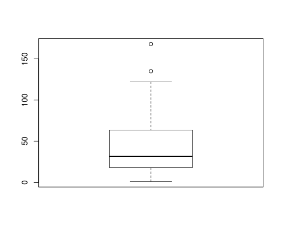

# O Essencial sobre a linguagem R
Jônatan Tatsch  
11-08-2015  


- - -

<p align="center">

</p>

- - -

# Introdução

Ao longo desse mini-curso iremos percorrer o caminho típico de uma análise básica de dados meteorológicos no R. Mas, nessa primeira etapa nós focaremos numa orientação básica sobre o R. O tema principal do curso (a diversão) começará na sessão de amanhã.

Todo o material do curso está disponível para download nesse [link](https://github.com/jdtatsch/Resbmet/archive/master.zip).

# RStudio

- Para abrir o [RStudio](https://www.rstudio.com/) no linux, digite no terminal

        $ rstudio &
<br/>
- Vamos criar um novo script (`script1.R`) para salvar as expressões que serão utilizadas nessa etapa do curso.
<br/>
<br/>
- Atalhos importante do RStudio

    - `Ctrl + <enter>`: envia comandos selecionados para execução no terminal do R
    - `Ctrl + l`: limpa tela do console do R
<br/>
<br/>
- *Tour* básico no [RStudio](https://www.rstudio.com/)


> <span style="color: red">Exercício:</span> Visualize o realce da sintaxe do R no [RStudio](https://www.rstudio.com/), copie o código desse [script](https://gist.githubusercontent.com/jdtatsch/df5fcf809362fe8825c1/raw/7642534479fb32de9e8faec1ca5a438fa572626a/get_sounding_data.R) que será aberto em seu navegador e cole-o em um novo script (denominado `get_sounding_data.R`) do [RStudio](https://www.rstudio.com/). Compare o código mostrado no navegador com o código mostrado no [RStudio](https://www.rstudio.com/)

<br/>
<br/> 
  
  
# Funcionalidade básica do R

- *prompt* do *R* (` > `) e operações aritméticas


```r
> 15 + 4
```

```
[1] 19
```

```r
> pi
```

```
[1] 3.141593
```

```r
> 60*pi/180
```

```
[1] 1.047198
```

```r
> # resto da divisao
> 10 %% 4
```

```
[1] 2
```

```r
> 2000 %% 4
```

```
[1] 0
```

```r
> 1990 %% 4
```

```
[1] 2
```

```r
> # parte inteira da divisão
> 11/2
```

```
[1] 5.5
```

```r
> 11 %/% 2
```

```
[1] 5
```

  - `#` é usado para fazer **comentários**

  - `+` indica que **continuação de uma expressão**


```r
> # COMENTÁRIO: selecione a expressão abaixo até o sinal de menos e então tecle <enter>.
> 4 -
+   
+   3
```

```
[1] 1
```

Enquanto a expressão não estiver completa o sinal de `+` se repetirá. Até que você digite o número que deseja subtrair de `4`.

 - Expressões executadas em sequência
 

```r
> 15 + 4; pi; 60*pi/180; 4-3
```

```
[1] 19
```

```
[1] 3.141593
```

```
[1] 1.047198
```

```
[1] 1
```

 - Auto preenchimento de funções


```r
read#<tab> pressione <tab> para ver as opções de comandos que iniciam com o termo read
```

 - Acesso ao histórico de expressões (no console do R, tecle a seta para cima )
 
<span style="color: red">parei aqui</span>

# Usando Funções

O R é uma *linguagem de programação funcional*. Tudo no R são funções. O valor de saída de uma função depende somente de argumentos que são entrada(s) para a função. 

A sintaxe básica de uma função segue a forma:


```r
nome_da_funcao(arg1, arg2)
```

O R possui uma série de funções internas disponíveis com a sua instalação.


```r
exp(x = 1) # neperiano ou num. de euler
```

```
[1] 2.718282
```

```r
log(10)
```

```
[1] 2.302585
```

```r
log(x = 10, base = 10)
```

```
[1] 1
```

```r
log(exp(1))
```

```
[1] 1
```

```r
seq(from = 1, to = 10, by = 0.5)
```

```
 [1]  1.0  1.5  2.0  2.5  3.0  3.5  4.0  4.5  5.0  5.5  6.0  6.5  7.0  7.5
[15]  8.0  8.5  9.0  9.5 10.0
```

```r
cos(x = 60*pi/180)
```

```
[1] 0.5
```

```r
pi
```

```
[1] 3.141593
```

```r
# arrendondamentos
round(pi, 6)
```

```
[1] 3.141593
```

```r
trunc(pi)
```

```
[1] 3
```

> Funções são identificadas por serem precedidas de parênteses.

# Criando e manipulando objetos do R

Atribuição de valores a variáveis.


```r
# criando variável
n <- 5
n
```

```
[1] 5
```

```r
ls()
```

```
[1] "n"
```

```r
# removendo a variável n
rm(n)
ls()
```

```
character(0)
```

Existem diversos tipo de objetos no R, mas os mais comuns são `numeric` e `character`.


```r
# colocando a expressão entre parênteses já imprime o resultado no console
(num <- 3.14) 
```

```
[1] 3.14
```

```r
(char <- "VI encontro sul brasileiro de meteorologia")
```

```
[1] "VI encontro sul brasileiro de meteorologia"
```

```r
(trimestres <- c("DJF", "MAM", "JJA", "SON"))
```

```
[1] "DJF" "MAM" "JJA" "SON"
```

## Vetores


```r
# criam-se vetores concatenando 'c()' valores
vetor <- c(2,5,8,3,7)
# sequencia
(vetor <- 10:20)
```

```
 [1] 10 11 12 13 14 15 16 17 18 19 20
```

```r
# tamanho do vetor
length(vetor)
```

```
[1] 11
```

Vetores podem acessados de várias formas usando colchetes `[ ]`.


```r
# selecionando 3o elemento do vetor
vetor[3]
```

```
[1] 12
```

```r
# o vetor sem a 1a posição
vetor[-1]
```

```
 [1] 11 12 13 14 15 16 17 18 19 20
```

```r
# o vetor sem a última posição
vetor[-length(vetor)]
```

```
 [1] 10 11 12 13 14 15 16 17 18 19
```

```r
# selecionando do 3o ao 6o elemento do vetor
vetor[3:6]
```

```
[1] 12 13 14 15
```

```r
# selecionando o 1o, 3o e 8o elemento do vetor
vetor[c(1,3,8)]
```

```
[1] 10 12 17
```

```r
# teste lógico
vetor > 15
```

```
 [1] FALSE FALSE FALSE FALSE FALSE FALSE  TRUE  TRUE  TRUE  TRUE  TRUE
```

```r
# seleção de elementos do vetor usando vetor lógico
vetor[vetor > 15]
```

```
[1] 16 17 18 19 20
```

```r
vetor[c(TRUE, FALSE)]
```

```
[1] 10 12 14 16 18 20
```

```r
vetor
```

```
 [1] 10 11 12 13 14 15 16 17 18 19 20
```

```r
vetor[c(FALSE, FALSE, TRUE)]
```

```
[1] 12 15 18
```

## Vetores lógicos (verdadeiro ou falso?)

Verificando se um vetor contém um valor.


```r
5 %in% vetor
```

```
[1] FALSE
```

```r
12 %in% vetor
```

```
[1] TRUE
```

```r
c(5, 12) %in% vetor
```

```
[1] FALSE  TRUE
```

```r
# verificando se o vetor contém alguns valores
vetor %in% c(11, 19)
```

```
 [1] FALSE  TRUE FALSE FALSE FALSE FALSE FALSE FALSE FALSE  TRUE FALSE
```

Encontrando a posição dos valores contidos no vetor.


```r
which(vetor %in% c(11, 19))
```

```
[1]  2 10
```

```r
which(vetor == 11)
```

```
[1] 2
```

```r
which(vetor != 11)
```

```
 [1]  1  3  4  5  6  7  8  9 10 11
```

```r
vetor[which(vetor != 11)]
```

```
 [1] 10 12 13 14 15 16 17 18 19 20
```

```r
# vetor de horas
(horas <- c(0:23, 0:23))
```

```
 [1]  0  1  2  3  4  5  6  7  8  9 10 11 12 13 14 15 16 17 18 19 20 21 22
[24] 23  0  1  2  3  4  5  6  7  8  9 10 11 12 13 14 15 16 17 18 19 20 21
[47] 22 23
```

```r
# vetor lógico indicando se é noite
eh_noite <- horas > 18 | horas < 6
# posicoes do vetor horas que correspondem a noite
pos_noturna <- which(eh_noite)
# posicoes do vetor horas que correspondem a noite
#eh_dia <- horas <= 18 & horas >= 6
eh_dia <- !eh_noite
pos_dia <- which(eh_dia)
```


----------------------------------
 Operador         Descrição       
---------- -----------------------
    <             menor que       

    <=        menor ou igual a    

    >             maior que       

    >=         maior ou igual     

    ==            idêntico        

    !=            diferente       

    !x        não é x (negação)   

  x | y            x ou y         

  x & y             x e y         

isTRUE(x)  teste se x é verdadeiro

   %in%        está contido em    
----------------------------------

Table: Tabela 1. Operadores Lógicos

### Sequências e repetições


```r
## horas
h <- 0:23
length(h)
```

```
[1] 24
```

```r
# meia-horas
mh <- seq(0, 23, by = 0.5)
length(mh)
```

```
[1] 47
```

```r
# 24 horas dividas igualmente em 10 pontos
h10 <- seq(0, 23, length.out = 10)
length(h10)
```

```
[1] 10
```

```r
# repetição de números
(rep1 <- rep(1:2, times = 4))
```

```
[1] 1 2 1 2 1 2 1 2
```

```r
(rep2 <- rep(1:2, each = 4))
```

```
[1] 1 1 1 1 2 2 2 2
```

```r
(rep_t13 <- rep(c("chuva","sol"), times = c(1,3)))
```

```
[1] "chuva" "sol"   "sol"   "sol"  
```

```r
(rep_t13_t4 <- rep(rep(c("chuva","sol"), 
                       times = c(1,3)), 
                   times = 4))
```

```
 [1] "chuva" "sol"   "sol"   "sol"   "chuva" "sol"   "sol"   "sol"  
 [9] "chuva" "sol"   "sol"   "sol"   "chuva" "sol"   "sol"   "sol"  
```

### Lidando com dados faltantes

**NA: Not Available**


```r
# criando vetor com dados faltantes
(x <- 1:5)
```

```
[1] 1 2 3 4 5
```

```r
x[8] <- 8
x[3] <- NA
print(x)
```

```
[1]  1  2 NA  4  5 NA NA  8
```

```r
# onde há dados faltantes
is.na(x)
```

```
[1] FALSE FALSE  TRUE FALSE FALSE  TRUE  TRUE FALSE
```

```r
# valores dos elementos válidos?
x[!is.na(x)]
```

```
[1] 1 2 4 5 8
```


## Matrizes

Matriz é um vetor de 2 dimensões (linas e colunas) com mesmo tipo de dados.


```r
(mat <- matrix(data = 1:15, nrow = 3, ncol = 5))
```

```
     [,1] [,2] [,3] [,4] [,5]
[1,]    1    4    7   10   13
[2,]    2    5    8   11   14
[3,]    3    6    9   12   15
```

```r
# transposta da mat
t(mat)
```

```
     [,1] [,2] [,3]
[1,]    1    2    3
[2,]    4    5    6
[3,]    7    8    9
[4,]   10   11   12
[5,]   13   14   15
```

```r
(mat1 <- matrix(data = 1:15, nrow = 3, ncol = 5, byrow = TRUE))
```

```
     [,1] [,2] [,3] [,4] [,5]
[1,]    1    2    3    4    5
[2,]    6    7    8    9   10
[3,]   11   12   13   14   15
```

```r
# convertendo matriz para vetor
c(mat)
```

```
 [1]  1  2  3  4  5  6  7  8  9 10 11 12 13 14 15
```

```r
# convertenoo matriz para vetor seguindo as linhas
c(t(mat1))
```

```
 [1]  1  2  3  4  5  6  7  8  9 10 11 12 13 14 15
```

```r
# operações lógicas também funcionam com matrizes
mat1 > 5
```

```
      [,1]  [,2]  [,3]  [,4]  [,5]
[1,] FALSE FALSE FALSE FALSE FALSE
[2,]  TRUE  TRUE  TRUE  TRUE  TRUE
[3,]  TRUE  TRUE  TRUE  TRUE  TRUE
```

Informações sobre a estrutura da matriz.


```r
# num. de linhas da matriz
nrow(mat)
```

```
[1] 3
```

```r
# num. de colunas
ncol(mat)
```

```
[1] 5
```

```r
# num. de elementos
ncol(mat) * nrow(mat)
```

```
[1] 15
```

```r
# classe dos dados
class(mat)
```

```
[1] "matrix"
```

```r
# modo (numeric, character, logical)
mode(mat)
```

```
[1] "numeric"
```

## Data frame 

Um data frame é como uma matriz mas é capaz de acomodar campos (colunas) com diferentes tipos de dados. Cada linha do `data-frame` corresponde a um registro da tabela e cada coluna corresponde ao registro de uma variável na tabela.


```r
## criando um dataframe
dados <- data.frame(dates = c("2013-01-01", "2013-01-02", "2013-01-03", "2013-01-04", "2013-01-05", 
                                 "2013-01-06", "2013-01-07", "2013-01-08", "2013-01-09", "2013-01-10", 
                                 "2013-01-11", "2013-01-12", "2013-01-13", "2013-01-14", "2013-01-15"), 
                       cidade = rep("Santa Maria", 15),    
                       tar = c(31, 35, 21, 23, 33, 17, 18, 16, 34, 27, 15, 28, 22, 29, 32), stringsAsFactors = FALSE)  
dados
```

```
        dates      cidade tar
1  2013-01-01 Santa Maria  31
2  2013-01-02 Santa Maria  35
3  2013-01-03 Santa Maria  21
4  2013-01-04 Santa Maria  23
5  2013-01-05 Santa Maria  33
6  2013-01-06 Santa Maria  17
7  2013-01-07 Santa Maria  18
8  2013-01-08 Santa Maria  16
9  2013-01-09 Santa Maria  34
10 2013-01-10 Santa Maria  27
11 2013-01-11 Santa Maria  15
12 2013-01-12 Santa Maria  28
13 2013-01-13 Santa Maria  22
14 2013-01-14 Santa Maria  29
15 2013-01-15 Santa Maria  32
```

```r
class(dados)
```

```
[1] "data.frame"
```


Data frame pode ser facilmente visualizados:

```r
View(dados)
```

Examine a estrutura interna de um dataframe

```r
str(dados)
```

```
'data.frame':	15 obs. of  3 variables:
 $ dates : chr  "2013-01-01" "2013-01-02" "2013-01-03" "2013-01-04" ...
 $ cidade: chr  "Santa Maria" "Santa Maria" "Santa Maria" "Santa Maria" ...
 $ tar   : num  31 35 21 23 33 17 18 16 34 27 ...
```

### Seleção de partes de um data frame


```r
# por números
dados[1,]
```

```
       dates      cidade tar
1 2013-01-01 Santa Maria  31
```

```r
dados[2:3,]
```

```
       dates      cidade tar
2 2013-01-02 Santa Maria  35
3 2013-01-03 Santa Maria  21
```

```r
dados[,1]
```

```
 [1] "2013-01-01" "2013-01-02" "2013-01-03" "2013-01-04" "2013-01-05"
 [6] "2013-01-06" "2013-01-07" "2013-01-08" "2013-01-09" "2013-01-10"
[11] "2013-01-11" "2013-01-12" "2013-01-13" "2013-01-14" "2013-01-15"
```

```r
dados[2,1]
```

```
[1] "2013-01-02"
```

```r
# por nomes
dados$tar
```

```
 [1] 31 35 21 23 33 17 18 16 34 27 15 28 22 29 32
```

```r
dados$tar[2:4]
```

```
[1] 35 21 23
```

```r
dados[, "tar"]
```

```
 [1] 31 35 21 23 33 17 18 16 34 27 15 28 22 29 32
```

```r
dados[2:4, "tar"]
```

```
[1] 35 21 23
```

```r
dados["dates"]
```

```
        dates
1  2013-01-01
2  2013-01-02
3  2013-01-03
4  2013-01-04
5  2013-01-05
6  2013-01-06
7  2013-01-07
8  2013-01-08
9  2013-01-09
10 2013-01-10
11 2013-01-11
12 2013-01-12
13 2013-01-13
14 2013-01-14
15 2013-01-15
```

```r
class(dados["dates"])
```

```
[1] "data.frame"
```

```r
is.vector(dados["dates"])
```

```
[1] FALSE
```

```r
dados[["dates"]]
```

```
 [1] "2013-01-01" "2013-01-02" "2013-01-03" "2013-01-04" "2013-01-05"
 [6] "2013-01-06" "2013-01-07" "2013-01-08" "2013-01-09" "2013-01-10"
[11] "2013-01-11" "2013-01-12" "2013-01-13" "2013-01-14" "2013-01-15"
```

```r
is.vector(dados[["dates"]])
```

```
[1] TRUE
```

Data frames podem ter nomes associados às colunas e linhas.


```r
colnames(dados)  
```

```
[1] "dates"  "cidade" "tar"   
```

```r
names(dados)     # apenas para dataframes
```

```
[1] "dates"  "cidade" "tar"   
```

```r
rownames(dados)
```

```
 [1] "1"  "2"  "3"  "4"  "5"  "6"  "7"  "8"  "9"  "10" "11" "12" "13" "14"
[15] "15"
```

```r
# nomes podem ser alterados
names(dados) <- c("data", "municipio", "temp")
dados
```

```
         data   municipio temp
1  2013-01-01 Santa Maria   31
2  2013-01-02 Santa Maria   35
3  2013-01-03 Santa Maria   21
4  2013-01-04 Santa Maria   23
5  2013-01-05 Santa Maria   33
6  2013-01-06 Santa Maria   17
7  2013-01-07 Santa Maria   18
8  2013-01-08 Santa Maria   16
9  2013-01-09 Santa Maria   34
10 2013-01-10 Santa Maria   27
11 2013-01-11 Santa Maria   15
12 2013-01-12 Santa Maria   28
13 2013-01-13 Santa Maria   22
14 2013-01-14 Santa Maria   29
15 2013-01-15 Santa Maria   32
```

### Subconjunto de um data frame e filtragem 


```r
dados[dados$temp==28, ]                 # uma condição
```

```
         data   municipio temp
12 2013-01-12 Santa Maria   28
```

```r
dados[dados$data %in% c("2013-01-10", "2013-01-13"),]   # mais de uma condição
```

```
         data   municipio temp
10 2013-01-10 Santa Maria   27
13 2013-01-13 Santa Maria   22
```

### Adicionando novas linas e colunas


```r
(nova_linha <- data.frame(data="2013-01-15", municipio="São Sepé", temp = 10))
```

```
        data municipio temp
1 2013-01-15  São Sepé   10
```

```r
# cola linha
(dados <- rbind(dados, nova_linha))
```

```
         data   municipio temp
1  2013-01-01 Santa Maria   31
2  2013-01-02 Santa Maria   35
3  2013-01-03 Santa Maria   21
4  2013-01-04 Santa Maria   23
5  2013-01-05 Santa Maria   33
6  2013-01-06 Santa Maria   17
7  2013-01-07 Santa Maria   18
8  2013-01-08 Santa Maria   16
9  2013-01-09 Santa Maria   34
10 2013-01-10 Santa Maria   27
11 2013-01-11 Santa Maria   15
12 2013-01-12 Santa Maria   28
13 2013-01-13 Santa Maria   22
14 2013-01-14 Santa Maria   29
15 2013-01-15 Santa Maria   32
16 2013-01-15    São Sepé   10
```

```r
(nova_coluna <- data.frame(tmin = sort(dados$temp)-5))
```

```
   tmin
1     5
2    10
3    11
4    12
5    13
6    16
7    17
8    18
9    22
10   23
11   24
12   26
13   27
14   28
15   29
16   30
```

```r
# cola coluna
(dados <- cbind(dados, nova_coluna))
```

```
         data   municipio temp tmin
1  2013-01-01 Santa Maria   31    5
2  2013-01-02 Santa Maria   35   10
3  2013-01-03 Santa Maria   21   11
4  2013-01-04 Santa Maria   23   12
5  2013-01-05 Santa Maria   33   13
6  2013-01-06 Santa Maria   17   16
7  2013-01-07 Santa Maria   18   17
8  2013-01-08 Santa Maria   16   18
9  2013-01-09 Santa Maria   34   22
10 2013-01-10 Santa Maria   27   23
11 2013-01-11 Santa Maria   15   24
12 2013-01-12 Santa Maria   28   26
13 2013-01-13 Santa Maria   22   27
14 2013-01-14 Santa Maria   29   28
15 2013-01-15 Santa Maria   32   29
16 2013-01-15    São Sepé   10   30
```


## Listas

Estrutura de dados muito versátil por pelo menos 3 razões:

  1. Os elementos podem ser de diferentes classes de objetos (p.ex.: um elemento `numeric`, outro `character`);
  2. Cada elemento pode ter um tamanho diferente;
  3. Os elementos podem conter diferentes estrutura de dados (p.ex.: um elemento `matrix`, outro `vector`);
  
Dentro da lista o conjunto de objetos são ordenados e cada elemento pode conter sub-elementos.


```r
lst <- list()
# forma de atribuir ou incluir itens na lista
lst[1] = "one"
lst[[2]] <- "two"
lst[length(lst)+1] <- "three"
print(lst)
```

```
[[1]]
[1] "one"

[[2]]
[1] "two"

[[3]]
[1] "three"
```

```r
# extraindo dados
# colchetes duplos significam que o objeto retornado é da classe de dados do item da lista
lst[[1]]      
```

```
[1] "one"
```

```r
# a selecionando mais que 1 item da lista é possível com colchetes simples
lst[2:3]
```

```
[[1]]
[1] "two"

[[2]]
[1] "three"
```

```r
# mas o objeto retornado é uma lista
lst[c(1,3)]   
```

```
[[1]]
[1] "one"

[[2]]
[1] "three"
```

```r
# deletetando itens de uma lista
lst[[3]] <- NULL
lst[1:2] <- NULL
lst
```

```
list()
```

```r
# dados em uma lista oidem ser armazenados com nomes
d <- list(seg=1, ter=2)
d['qua'] <- 3
print(d)
```

```
$seg
[1] 1

$ter
[1] 2

$qua
[1] 3
```

```r
d[['ter']]
```

```
[1] 2
```

```r
d[c('seg','qua')]
```

```
$seg
[1] 1

$qua
[1] 3
```


## Funções estatísticas básicas

```r
data("airquality")
x <- airquality$Temp
y <- airquality$Ozone
mean(x)
```

```
[1] 77.88235
```

```r
sd(x)
```

```
[1] 9.46527
```

```r
max(y)
```

```
[1] NA
```

```r
min(y)
```

```
[1] NA
```

```r
range(y)
```

```
[1] NA NA
```

```r
quantile(x, c(0.1, 0.9))
```

```
 10%  90% 
64.2 90.0 
```

```r
summary(airquality)
```

```
     Ozone           Solar.R           Wind             Temp      
 Min.   :  1.00   Min.   :  7.0   Min.   : 1.700   Min.   :56.00  
 1st Qu.: 18.00   1st Qu.:115.8   1st Qu.: 7.400   1st Qu.:72.00  
 Median : 31.50   Median :205.0   Median : 9.700   Median :79.00  
 Mean   : 42.13   Mean   :185.9   Mean   : 9.958   Mean   :77.88  
 3rd Qu.: 63.25   3rd Qu.:258.8   3rd Qu.:11.500   3rd Qu.:85.00  
 Max.   :168.00   Max.   :334.0   Max.   :20.700   Max.   :97.00  
 NA's   :37       NA's   :7                                       
     Month            Day      
 Min.   :5.000   Min.   : 1.0  
 1st Qu.:6.000   1st Qu.: 8.0  
 Median :7.000   Median :16.0  
 Mean   :6.993   Mean   :15.8  
 3rd Qu.:8.000   3rd Qu.:23.0  
 Max.   :9.000   Max.   :31.0  
                               
```

```r
cor(x, y, use = "complete.obs")
```

```
[1] 0.6983603
```

```r
# reordena o vetor
x
```

```
  [1] 67 72 74 62 56 66 65 59 61 69 74 69 66 68 58 64 66 57 68 62 59 73 61
 [24] 61 57 58 57 67 81 79 76 78 74 67 84 85 79 82 87 90 87 93 92 82 80 79
 [47] 77 72 65 73 76 77 76 76 76 75 78 73 80 77 83 84 85 81 84 83 83 88 92
 [70] 92 89 82 73 81 91 80 81 82 84 87 85 74 81 82 86 85 82 86 88 86 83 81
 [93] 81 81 82 86 85 87 89 90 90 92 86 86 82 80 79 77 79 76 78 78 77 72 75
[116] 79 81 86 88 97 94 96 94 91 92 93 93 87 84 80 78 75 73 81 76 77 71 71
[139] 78 67 76 68 82 64 71 81 69 63 70 77 75 76 68
```

```r
sort(x)
```

```
  [1] 56 57 57 57 58 58 59 59 61 61 61 62 62 63 64 64 65 65 66 66 66 67 67
 [24] 67 67 68 68 68 68 69 69 69 70 71 71 71 72 72 72 73 73 73 73 73 74 74
 [47] 74 74 75 75 75 75 76 76 76 76 76 76 76 76 76 77 77 77 77 77 77 77 78
 [70] 78 78 78 78 78 79 79 79 79 79 79 80 80 80 80 80 81 81 81 81 81 81 81
 [93] 81 81 81 81 82 82 82 82 82 82 82 82 82 83 83 83 83 84 84 84 84 84 85
[116] 85 85 85 85 86 86 86 86 86 86 86 87 87 87 87 87 88 88 88 89 89 90 90
[139] 90 91 91 92 92 92 92 92 93 93 93 94 94 96 97
```

```r
(o <- order(x))
```

```
  [1]   5  18  25  27  15  26   8  21   9  23  24   4  20 148  16 144   7
 [18]  49   6  13  17   1  28  34 140  14  19 142 153  10  12 147 149 137
 [35] 138 145   2  48 114  22  50  58  73 133   3  11  33  82  56 115 132
 [52] 151  31  51  53  54  55 110 135 141 152  47  52  60 108 113 136 150
 [69]  32  57 111 112 131 139  30  37  46 107 109 116  45  59  76 106 130
 [86]  29  64  74  77  83  92  93  94 117 134 146  38  44  72  78  84  87
[103]  95 105 143  61  66  67  91  35  62  65  79 129  36  63  81  86  97
[120]  85  88  90  96 103 104 118  39  41  80  98 128  68  89 119  71  99
[137]  40 100 101  75 124  43  69  70 102 125  42 126 127 121 123 122 120
```

```r
# ordenando dataframe pela ordem de x
airquality[o, ]
```

```
    Ozone Solar.R Wind Temp Month Day
5      NA      NA 14.3   56     5   5
18      6      78 18.4   57     5  18
25     NA      66 16.6   57     5  25
27     NA      NA  8.0   57     5  27
15     18      65 13.2   58     5  15
26     NA     266 14.9   58     5  26
8      19      99 13.8   59     5   8
21      1       8  9.7   59     5  21
9       8      19 20.1   61     5   9
23      4      25  9.7   61     5  23
24     32      92 12.0   61     5  24
4      18     313 11.5   62     5   4
20     11      44  9.7   62     5  20
148    14      20 16.6   63     9  25
16     14     334 11.5   64     5  16
144    13     238 12.6   64     9  21
7      23     299  8.6   65     5   7
49     20      37  9.2   65     6  18
6      28      NA 14.9   66     5   6
13     11     290  9.2   66     5  13
17     34     307 12.0   66     5  17
1      41     190  7.4   67     5   1
28     23      13 12.0   67     5  28
34     NA     242 16.1   67     6   3
140    18     224 13.8   67     9  17
14     14     274 10.9   68     5  14
19     30     322 11.5   68     5  19
142    24     238 10.3   68     9  19
153    20     223 11.5   68     9  30
10     NA     194  8.6   69     5  10
12     16     256  9.7   69     5  12
147     7      49 10.3   69     9  24
149    30     193  6.9   70     9  26
137     9      24 10.9   71     9  14
138    13     112 11.5   71     9  15
145    23      14  9.2   71     9  22
2      36     118  8.0   72     5   2
48     37     284 20.7   72     6  17
114     9      36 14.3   72     8  22
22     11     320 16.6   73     5  22
50     12     120 11.5   73     6  19
58     NA      47 10.3   73     6  27
73     10     264 14.3   73     7  12
133    24     259  9.7   73     9  10
3      12     149 12.6   74     5   3
11      7      NA  6.9   74     5  11
33     NA     287  9.7   74     6   2
82     16       7  6.9   74     7  21
56     NA     135  8.0   75     6  25
115    NA     255 12.6   75     8  23
132    21     230 10.9   75     9   9
151    14     191 14.3   75     9  28
31     37     279  7.4   76     5  31
51     13     137 10.3   76     6  20
53     NA      59  1.7   76     6  22
54     NA      91  4.6   76     6  23
55     NA     250  6.3   76     6  24
110    23     115  7.4   76     8  18
135    21     259 15.5   76     9  12
141    13      27 10.3   76     9  18
152    18     131  8.0   76     9  29
47     21     191 14.9   77     6  16
52     NA     150  6.3   77     6  21
60     NA      31 14.9   77     6  29
108    22      71 10.3   77     8  16
113    21     259 15.5   77     8  21
136    28     238  6.3   77     9  13
150    NA     145 13.2   77     9  27
32     NA     286  8.6   78     6   1
57     NA     127  8.0   78     6  26
111    31     244 10.9   78     8  19
112    44     190 10.3   78     8  20
131    23     220 10.3   78     9   8
139    46     237  6.9   78     9  16
30    115     223  5.7   79     5  30
37     NA     264 14.3   79     6   6
46     NA     322 11.5   79     6  15
107    NA      64 11.5   79     8  15
109    59      51  6.3   79     8  17
116    45     212  9.7   79     8  24
45     NA     332 13.8   80     6  14
59     NA      98 11.5   80     6  28
76      7      48 14.3   80     7  15
106    65     157  9.7   80     8  14
130    20     252 10.9   80     9   7
29     45     252 14.9   81     5  29
64     32     236  9.2   81     7   3
74     27     175 14.9   81     7  13
77     48     260  6.9   81     7  16
83     NA     258  9.7   81     7  22
92     59     254  9.2   81     7  31
93     39      83  6.9   81     8   1
94      9      24 13.8   81     8   2
117   168     238  3.4   81     8  25
134    44     236 14.9   81     9  11
146    36     139 10.3   81     9  23
38     29     127  9.7   82     6   7
44     23     148  8.0   82     6  13
72     NA     139  8.6   82     7  11
78     35     274 10.3   82     7  17
84     NA     295 11.5   82     7  23
87     20      81  8.6   82     7  26
95     16      77  7.4   82     8   3
105    28     273 11.5   82     8  13
143    16     201  8.0   82     9  20
61     NA     138  8.0   83     6  30
66     64     175  4.6   83     7   5
67     40     314 10.9   83     7   6
91     64     253  7.4   83     7  30
35     NA     186  9.2   84     6   4
62    135     269  4.1   84     7   1
65     NA     101 10.9   84     7   4
79     61     285  6.3   84     7  18
129    32      92 15.5   84     9   6
36     NA     220  8.6   85     6   5
63     49     248  9.2   85     7   2
81     63     220 11.5   85     7  20
86    108     223  8.0   85     7  25
97     35      NA  7.4   85     8   5
85     80     294  8.6   86     7  24
88     52      82 12.0   86     7  27
90     50     275  7.4   86     7  29
96     78      NA  6.9   86     8   4
103    NA     137 11.5   86     8  11
104    44     192 11.5   86     8  12
118    73     215  8.0   86     8  26
39     NA     273  6.9   87     6   8
41     39     323 11.5   87     6  10
80     79     187  5.1   87     7  19
98     66      NA  4.6   87     8   6
128    47      95  7.4   87     9   5
68     77     276  5.1   88     7   7
89     82     213  7.4   88     7  28
119    NA     153  5.7   88     8  27
71     85     175  7.4   89     7  10
99    122     255  4.0   89     8   7
40     71     291 13.8   90     6   9
100    89     229 10.3   90     8   8
101   110     207  8.0   90     8   9
75     NA     291 14.9   91     7  14
124    96     167  6.9   91     9   1
43     NA     250  9.2   92     6  12
69     97     267  6.3   92     7   8
70     97     272  5.7   92     7   9
102    NA     222  8.6   92     8  10
125    78     197  5.1   92     9   2
42     NA     259 10.9   93     6  11
126    73     183  2.8   93     9   3
127    91     189  4.6   93     9   4
121   118     225  2.3   94     8  29
123    85     188  6.3   94     8  31
122    84     237  6.3   96     8  30
120    76     203  9.7   97     8  28
```

### Regressão linear e gráfico de dispersão


```r
# regressão linear
(reg <- lm(y~x))
```

```

Call:
lm(formula = y ~ x)

Coefficients:
(Intercept)            x  
   -146.995        2.429  
```

```r
summary(reg)
```

```

Call:
lm(formula = y ~ x)

Residuals:
    Min      1Q  Median      3Q     Max 
-40.729 -17.409  -0.587  11.306 118.271 

Coefficients:
             Estimate Std. Error t value Pr(>|t|)    
(Intercept) -146.9955    18.2872  -8.038 9.37e-13 ***
x              2.4287     0.2331  10.418  < 2e-16 ***
---
Signif. codes:  0 '***' 0.001 '**' 0.01 '*' 0.05 '.' 0.1 ' ' 1

Residual standard error: 23.71 on 114 degrees of freedom
  (37 observations deleted due to missingness)
Multiple R-squared:  0.4877,	Adjusted R-squared:  0.4832 
F-statistic: 108.5 on 1 and 114 DF,  p-value: < 2.2e-16
```

```r
plot(x, y); abline(coef(reg))
```

 

```r
hist(x)
```

 

```r
boxplot(y)
```

 


# Pacotes

Instalação e lista de funções.


```r
install.packages("nome_do_pacote")
install.packages("sfsmisc")
# obtém ajuda sobre um pacote (list suas funções)
library(help = openair)  
```


# Obtendo ajuda


```r
# use '?' para ajuda sobre qualquer função do R (se o pacote tiver sido carregado na seção)
?max
# procura pelo texto na documentação dos pacotes do R
??csv
```


# Manipulação de arquivos e diretórios


```r
# diretório de trabalho: onde estamos com a seção do R aberta
getwd()
```

```
[1] "/home/hidrometeorologista/UFSM/extensao/cursos/Resbmet"
```

```r
dir()
```

```
 [1] "0_Rinstall.html"          "0_Rinstall.md"           
 [3] "0_Rinstall.Rmd"           "1_Ressencial.html"       
 [5] "1_Ressencial.md"          "1_Ressencial.Rmd"        
 [7] "figs"                     "introducao_resbmet.html" 
 [9] "introducao_resbmet.md"    "introducao_resbmet.Rpres"
[11] "my_style.css"             "R"                       
[13] "README.html"              "README.md"               
[15] "Resbmet.Rproj"           
```

```r
# mudando o diretório de trabalho
setwd("../../")
getwd()
```

```
[1] "/home/hidrometeorologista/UFSM/extensao"
```

```r
file.exists()
```

```
Error in file.exists(): invalid 'file' argument
```

```r
file.path()
```

```
character(0)
```

```r
list.files("../")
```

```
[1] "013.pdf"                           
[2] "adm"                               
[3] "ensino"                            
[4] "extensao"                          
[5] "ips_inpe"                          
[6] "Mem076.2014CPPD_minimo_8h-aula.pdf"
[7] "orientacoes"                       
[8] "outros"                            
[9] "pesquisa"                          
```

# Manipulação de Caracteres


# Datas e horas


