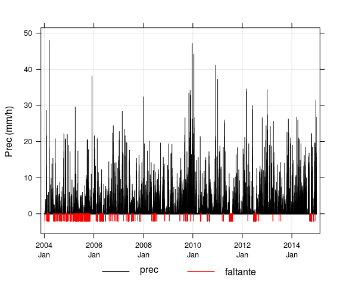
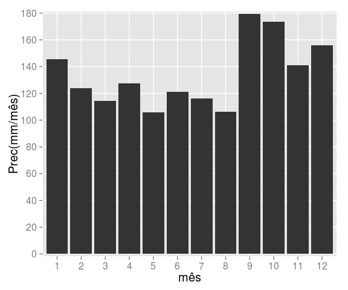
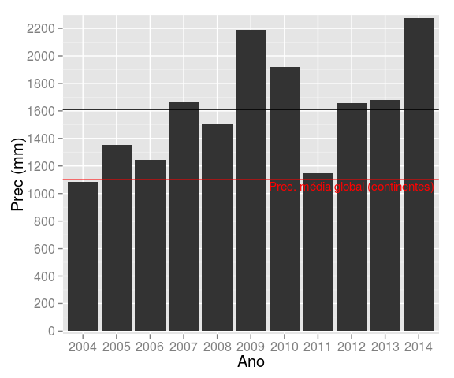
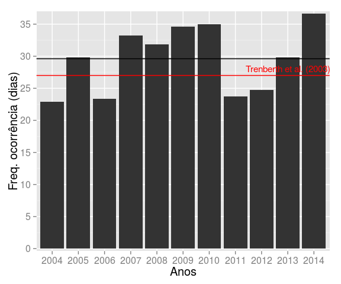
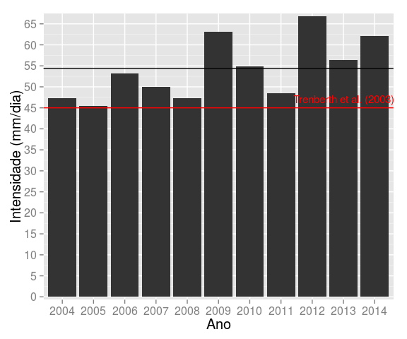
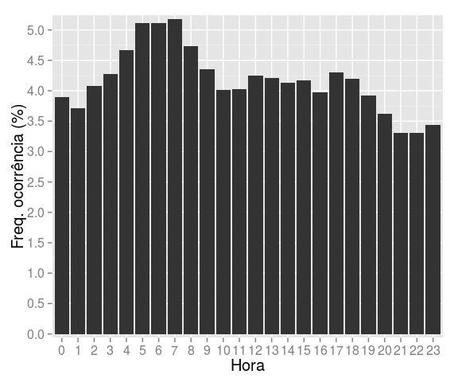
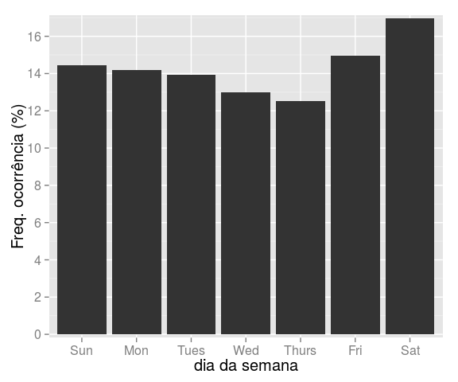

# Manipulação de dados meteorológicos
Jônatan Tatsch  
11-08-2015  


- - -

<p align="center">

</p>

- - -

# Introdução

> É frequentemente dito que 80% do tempo usado análise dados é gasto no processo de preparação dos dados [(Dasu e Johnson 2003)](http://onlinelibrary.wiley.com/doi/10.1002/0471448354.ch4/summary).


# Dados padronizados

Dados bem estruturados servem para 2 propostas:
- fornecem dados propícios para o processamento e análise de dados por softwares;
- revelam informações e facilitam a percepção de padrões

[Hadley 2014](http://www.jstatsoft.org/article/view/v059i10) fornece uma excelente explicação sobre o conceito de de *tidy data*, aqui traduzido como dados padronizados.


Embora muitas funções fundamentais de processamento de dados existam no R, elas são um pouco complicadas e limitadas em termos de uma codificação consistente e de se complementarem. Isso leva a uma dificuldade de ler funções aninhadas e um código desordenado.
Como resultado um monte de tarefas de processamento vem tornando-se mais coesas e disponíveis na forma de pacotes do R, levando a:

- um código mais eficiente 
- uma sintaxe mais fácil de ser lembrada
- uma sintaxe mais fácil de ler


# Pré-requisitos

Pacotes necessários:


```r
# carregando pacotes para gráficos
library(lattice)
library(scales)
library(ggplot2)
# carregando pacotes para manipulação de dados
library(plyr)
library(dplyr)
library(tidyr)
library(lubridate)
library(openair)
library(readr)
```

Os pacotes [tidyr](https://cran.r-project.org/package=tidyr) e [dplyr ](https://cran.r-project.org/package=dplyr) fornecem funções fundamentais para a limpeza, processamento e manipulação de dados meteorológicos.

As principais funções são:

- **tidyr**

    - gather()
  
    - spread()
   
    - separate()
   
    - unite()

- **dplyr**

    - select()
   
    - filter()
   
    - group_by()

    - summarise()
   
    - arrange()
   
    - join()
   
    - mutate()

# OperadoR %>% 

Embora não requerido os pacotes tidyr e dplyr usam o operador pipe `%>%` que quando combinado com vários funções forma uma cadeia de processamento de dados, ao invés do aninhamento de funções que limita a legibilidade do código. 


```r
# exemplo simples para aplicar uma função 
quadrado <- function(x) x^2
a <- 2
quadrado(a)
```

```
[1] 4
```

```r
a %>% quadrado
```

```
[1] 4
```

Este operador irá transmitir um valor, ou o resultado de uma expressão, para a próxima função/expressão  chamada. Por exemplo, uma função para filtrar os dados pode ser escrito como:


```r
# exemplo com um dataframe
data(airquality)
filter(airquality, Ozone == 23)
```

```
  Ozone Solar.R Wind Temp Month Day
1    23     299  8.6   65     5   7
2    23      13 12.0   67     5  28
3    23     148  8.0   82     6  13
4    23     115  7.4   76     8  18
5    23     220 10.3   78     9   8
6    23      14  9.2   71     9  22
```

```r
# ou
airquality %>% filter(Ozone == 23)
```

```
  Ozone Solar.R Wind Temp Month Day
1    23     299  8.6   65     5   7
2    23      13 12.0   67     5  28
3    23     148  8.0   82     6  13
4    23     115  7.4   76     8  18
5    23     220 10.3   78     9   8
6    23      14  9.2   71     9  22
```

Ambas funções realizam a mesma tarefa e o benefício de usar  `%>%'não é evidente. Entretanto, quando desejamos realizar várias funções sua vantagem torna-se evidente. 
Por exemplo, se queremos selecionar algumas colunas, filtrar algum dados e fazer algum resumo estatístico:


```r
# opção aninhada 
(res <- summarize(filter(select(airquality, Ozone, Temp), Ozone > 23), tmed = mean(Temp)))
```

```
      tmed
1 82.72059
```

```r
# opção por partes
a <- select(airquality, Ozone, Temp)
b <- filter(a, Ozone > 23)
(c <- summarise(b, tmed = mean(Temp)))
```

```
      tmed
1 82.72059
```

```r
# opção usando pipe
res_pipe <- airquality %>% 
  select(Ozone, Temp) %>%
  filter(Ozone > 23) %>% 
  summarise(tmed = mean(Temp)) %>%
  print
```

```
      tmed
1 82.72059
```

Quando as suas tarefas aumentam o operador pipe `%>%` torna-se mais eficiente e o seu código fica mais legível.

Para aprender mais sobre `%>%` operator (e o pacote `magrittr` visite qualquer um dos seguintes sites:

- http://cran.r-project.org/web/packages/magrittr/vignettes/magrittr.html

- http://www.r-bloggers.com/simpler-r-coding-with-pipes-the-present-and-future-of-the-magrittr-package/

- http://blog.revolutionanalytics.com/2014/07/magrittr-simplifying-r-code-with-pipes.html


# Exemplo de aplicação aos dados de precipitação horária de SM

Objetivos:

- determinar a quantidade de dados de chuva horária faltantes em termos absolutos (número de casos) e relativos (% do total);

- visualizar por meio de um gráfico a variação temporal da chuva horária com a identificação das falhas

- determinar o número de dados faltantes por ano e verifique se o seu resultado confere com aquele da inspeção visual do gráfico;

- determinar o valor da chuva máxima horária e a data de ocorrência do evento;

- determinar a chuva máxima diária e a data de ocorrência do evento;

- fazer o pluviograma mensal climatológico (médias dos totais mensais de precipitação);

- plotar os totais anuais de chuva para cada ano;

- determinar a frequência de ocorrência da chuva para cada ano;

- determinar a intensidade média da chuva (em mm/dia) em Santa Maria;

- determinar a frequência de ocorrência de chuva (ou seja, o número de casos em que choveu) para cada hora do dia (das 0 às 23 h)

- determinar a frequência de ocorrência (%) de precipitação para cada dia da semana;


**1. Disponibilidade de dados.**

  a. Determine a quantidade de dados de chuva horária faltantes em termos absolutos (número de casos) e relativos (% do total).


```r
# definindo os horários como UTC para essa sessão do R
Sys.setenv(TZ = "UTC")
# importa dados, hprec: precipitação horária da EMA de SM
hprec <- read_csv(file = "data/hprec_sm.csv"    # nome do arquivo
                  ,col_names = TRUE        # tem cabeçalho? TRUE = verdadeiro, FALSE = falso
                  ,col_types = list(col_character(), 
                                    col_character(), 
                                    col_double())
                  ,na = "-9999")           # código usado para representar dados faltante
# converte data e horas para POSIX
hprec <- mutate(hprec, date = as.POSIXct(date))
# número de casos faltantes
sum(is.na(hprec$prec))
```

```
## [1] 4108
```

```r
# porcentagem de casos faltantes
sum(is.na(hprec$prec))/nrow(hprec) * 100
```

```
## [1] 4.260173
```

  
  b. Faça um gráfico da chuva horária no tempo que permita identificar os períodos de falhas e que os anos sejam visíveis no eixo x. O gráfico deve ter aspecto similar ao mostrado na Figura abaixo. 
  

```r
# dados para plot; adiciona uma prec modificada, para mostrar dados faltantes
hprec_plot <- mutate(hprec
                     ,faltante = ifelse(is.na(prec), -2, NA))
hprec_plot <- as.data.frame(hprec_plot)
# plot da chuva no tempo
#tp <- timePlot(selectByDate(hprec_plot, year = 2014)
tp <- timePlot(hprec_plot
         ,c("prec", "faltante")
         ,group = TRUE
         ,plot.type = "h"
         ,lty = 1
         ,col = c(1, 2)
         ,ylab = "Prec (mm/h)"
         ,date.format = "%Y\n%b" )
```



  c. Baseado na inspeção visual do seu gráfico qual o ano que tem mais falhas? Calcule o número de dados faltantes por ano e verifique se o seu resultado confere com aquele da inspeção visual do gráfico. Apresente esses resultados em uma tabela.


```r
######
# R: por inpeção visual sugere o ano de 2005 devido a sequência de falhas consecutivas
# Por meio do calculo verifica-se que foi 2011, uma falha longa contínua
######
tab_falt <- hprec %>%
  # agrupa os dados por anos
  group_by(year = lubridate::year(date)) %>%
  # resumo estatístico (soma, porcentagem) da prec para cada componente do grupo
  summarise(n_falt = sum(is.na(prec))
            ,perc_falt = round(sum(is.na(prec))/n() * 100, 1))
tab_falt
```

```
## Source: local data frame [11 x 3]
## 
##     year n_falt perc_falt
##    (dbl)  (int)     (dbl)
## 1   2004    155       1.8
## 2   2005    816       9.3
## 3   2006    427       4.9
## 4   2007    290       3.3
## 5   2008     50       0.6
## 6   2009     42       0.5
## 7   2010     62       0.7
## 8   2011   1120      12.8
## 9   2012    313       3.6
## 10  2013     15       0.2
## 11  2014    818       9.3
```

- - - 

**2. Estatísticas básicas. Desconsidere os registros faltantes em seus cálculos.** 
  
  (a) Qual o valor da chuva máxima horária? Em que data ocorreu o evento?


```r
######
# (2a)
######
max(hprec$prec, na.rm = TRUE)
```

```
## [1] 48
```

```r
hprec %>% slice(which.max(prec)) %>% select(date)
```

```
## Source: local data frame [1 x 1]
## 
##                  date
##                (time)
## 1 2004-03-13 22:00:00
```

  (b) Qual a chuva máxima diária? Em que data ocorreu o evento?


```r
######
# (2b)
######
dprec <- 
  # agrupando os dados por data (dias)
  group_by(hprec, date = as.character(as.Date(date))) %>%
  # resumo estatístico (soma) da prec para cada componente do grupo
  dplyr::summarise(prec = sum(prec, na.rm = TRUE)) %>%
  # seleciona do resultado somente as colunas date e prec
  dplyr::select(date, prec) %>%
  # converte date para classe POSIX
  mutate(date = as.POSIXct(date))

# calcula máximo diário
max(dprec$prec)
```

```
## [1] 130.4
```

```r
# timePlot(dprec, "prec", plot.type = "h")
# encontra quando ocorreu o máximo
posicao <- which.max(dprec$prec)
dprec$date[posicao]
```

```
## [1] "2010-01-16 UTC"
```


**3. Pluviograma mensal climatológico.**


```r
######
# (3a) e (3b)
######
(n_anos <- length(unique(year(hprec$date))))
```

```
## [1] 11
```

```r
# tabela com médias dos totais mensais, média do num. horas com prec
# usando os dados HORÁRIOS
tab_mon_h <- 
  # agrupa dados por mês
  group_by(hprec, month = lubridate::month(date)) %>%
  # reumo estatístico para cada componente do grupo
  summarise(prec_med = sum(prec, na.rm = TRUE)/n_anos
            # total de horas com prec
            ,n_horas_tot = sum(prec > 0, na.rm = TRUE)
            # num. horas médio mensal (horas)
            ,n_horas_med = sum(prec > 0, na.rm = TRUE)/n_anos
            # num. horas médio mensal (dias)
            ,n_horas_med_d = (sum(prec > 0, na.rm = TRUE)/n_anos)/24)
#tab_mon_h
```

  (a) Faça um gráfico com as médias dos totais mensais de chuva.


```r
g0 <- ggplot(tab_mon_h, aes(x = factor(month), y = prec_med))
ggp1 <- g0 + geom_bar(stat = "identity") + 
        ylab("Prec(mm/mês)") + 
        xlab("mês")+
        scale_y_continuous(expand = c(0.01, 0.01), 
                           breaks = pretty_breaks(10)) +
        theme(text = element_text(size=15), axis.text.x = element_text(angle=0))
ggp1
```


  
  (b) Utilizando a série horária de chuva, determine o número médio de horas com chuva para cada mês. Converta a número de horas em dias para melhor comparação com o item (c).


```r
tab_mon_h
```

```
## Source: local data frame [12 x 5]
## 
##    month prec_med n_horas_tot n_horas_med n_horas_med_d
##    (dbl)    (dbl)       (int)       (dbl)         (dbl)
## 1      1 145.4364         474    43.09091      1.795455
## 2      2 124.0000         570    51.81818      2.159091
## 3      3 114.5818         469    42.63636      1.776515
## 4      4 127.6727         617    56.09091      2.337121
## 5      5 105.8364         679    61.72727      2.571970
## 6      6 121.0182         833    75.72727      3.155303
## 7      7 116.1636         740    67.27273      2.803030
## 8      8 106.0909         785    71.36364      2.973485
## 9      9 179.3091         947    86.09091      3.587121
## 10    10 173.3455         683    62.09091      2.587121
## 11    11 140.8182         543    49.36364      2.056818
## 12    12 156.0182         475    43.18182      1.799242
```
  
  (c) Utilizando a série de totais diários de chuva, determine o número médio de dias com chuva para cada mês. Compare com os resultados do item (b) e discuta os resultados. 


```r
######
# (3c)
######
# tabela com médias dos totais mensais, média do num. horas com prec
# usando os dados DIÁRIOS
tab_mon_d <- 
  # agrupa dados por mês
  group_by(dprec, month = lubridate::month(date)) %>%
  # resumo estatístico para cada componente do grupo
  summarise(prec_med = sum(prec, na.rm = TRUE)/n_anos
            ,n_dias = sum(prec > 0, na.rm = TRUE)
            ,n_dias_med = (sum(prec > 0, na.rm = TRUE)/n_anos))
tab_mon_d
```

```
## Source: local data frame [12 x 4]
## 
##    month prec_med n_dias n_dias_med
##    (dbl)    (dbl)  (int)      (dbl)
## 1      1 145.4364    125   11.36364
## 2      2 124.0000    131   11.90909
## 3      3 114.5818    133   12.09091
## 4      4 127.6727    185   16.81818
## 5      5 105.8364    203   18.45455
## 6      6 121.0182    220   20.00000
## 7      7 116.1636    168   15.27273
## 8      8 106.0909    182   16.54545
## 9      9 179.3091    166   15.09091
## 10    10 173.3455    140   12.72727
## 11    11 140.8182    110   10.00000
## 12    12 156.0182    115   10.45455
```
  
  (d) Compare a intensidade média da chuva para cada mês do ano obtida nos dois itens. Qual a importância das medidas horárias? 


```r
######
# (3d)
######
# insere coluna com intensidade baseada nos dados horários e diários
tab_mon_h <- mutate(tab_mon_h, intens_d = prec_med/n_horas_med_d)
tab_mon_d <- mutate(tab_mon_d, intens_d = prec_med/n_dias_med)
tab_intens <- data.frame(month = tab_mon_h$month,
                         #prec = tab_mon_h$prec_mon,
                         #nh_d = tab_mon_h$n_d,
                         #n_d =  tab_mon_d$n_d,
                         intens_d = tab_mon_d$intens_d,
                         intens_h = tab_mon_h$intens_d )
tab_intens
```

```
##    month  intens_d intens_h
## 1      1 12.798400 81.00253
## 2      2 10.412214 57.43158
## 3      3  9.476692 64.49808
## 4      4  7.591351 54.62820
## 5      5  5.734975 41.14993
## 6      6  6.050909 38.35390
## 7      7  7.605952 41.44216
## 8      8  6.412088 35.67898
## 9      9 11.881928 49.98691
## 10    10 13.620000 67.00322
## 11    11 14.081818 68.46409
## 12    12 14.923478 86.71326
```

**4. Pluviograma anual.** 

  (a) Faça um gráfico com os totais anuais de chuva para cada ano.


```r
######
# Solução geral (4a-c)
######
# tabela de resultados anuais
tab_year_h <- 
  # agrupa dados por ano
  group_by(hprec, year = lubridate::year(date)) %>%
  summarise(prec_tot = sum(prec, na.rm = TRUE)
            # num. total de horas com chuva por ano (em horas)
            ,n_horas_tot = sum(prec > 0, na.rm = TRUE)) %>%
            # num. total de horas com chuva por ano (em dias)
  mutate(n_horas_tot_d = round(n_horas_tot/24, 2)
         # intensidade por ano
         ,intens = prec_tot/n_horas_tot * 24
         # num. médio de "dias" (convertidos das horas) com chuva
         ,n_d_med = mean(n_horas_tot_d)
         # chuva total média anual
         ,prec_tot_med = mean(prec_tot)
         # instensidade média anual
         ,intens_med_d = prec_tot_med/n_d_med)
select(tab_year_h, year, prec_tot)
```

```
## Source: local data frame [11 x 2]
## 
##     year prec_tot
##    (dbl)    (dbl)
## 1   2004   1083.2
## 2   2005   1352.6
## 3   2006   1244.2
## 4   2007   1660.0
## 5   2008   1508.2
## 6   2009   2186.8
## 7   2010   1920.6
## 8   2011   1148.0
## 9   2012   1655.6
## 10  2013   1680.0
## 11  2014   2274.0
```


```r
######
# (4a)
######
# pluviograma anual
g4a <- ggplot(tab_year_h, aes(x = factor(year), y = prec_tot))
g4a + geom_bar(stat = "identity") + 
     ylab("Prec (mm)") + 
     xlab("Ano")+
     geom_hline(yintercept = mean(tab_year_h$prec_tot)) +
     geom_hline(yintercept = 1100, colour = "red") +
     scale_y_continuous(expand = c(0.01, 0.01), 
                        breaks = pretty_breaks(10)) +
     theme(text = element_text(size=15), axis.text.x = element_text(angle=0))+
     annotate("text", 
              x = 9, 
              y = 1100-50, 
              label = "Prec. média global (continentes)",
              colour = "red", size = 4)
```



  (b) Determine a frequência de ocorrência da chuva para cada ano. O gráfico deve apresentar a frequência de ocorrência em dias. 

*Para determinar a frequência de ocorrência de chuva para cada ano, devem ser contados o número horas de chuva (`prec > 0`) (`n_horas_tot`) e então multiplicar por 24 h para obtê-la a em dias (`n_horas_tot_d`).*
 

```r
select(tab_year_h, year, n_horas_tot, n_horas_tot_d, n_d_med)
```

```
## Source: local data frame [11 x 4]
## 
##     year n_horas_tot n_horas_tot_d  n_d_med
##    (dbl)       (int)         (dbl)    (dbl)
## 1   2004         550         22.92 29.60182
## 2   2005         715         29.79 29.60182
## 3   2006         561         23.38 29.60182
## 4   2007         797         33.21 29.60182
## 5   2008         764         31.83 29.60182
## 6   2009         831         34.62 29.60182
## 7   2010         839         34.96 29.60182
## 8   2011         569         23.71 29.60182
## 9   2012         595         24.79 29.60182
## 10  2013         715         29.79 29.60182
## 11  2014         879         36.62 29.60182
```


```r
# freq ocorrência
g4b <- ggplot(tab_year_h, aes(x = factor(year), y = n_horas_tot_d))
g4b + geom_bar(stat = "identity") + 
     ylab("Freq. ocorrência (dias)") + 
     xlab("Anos")+
     geom_hline(yintercept = mean(tab_year_h$n_d_med)) +
     geom_hline(yintercept = 27, colour = "red") +
     scale_y_continuous(expand = c(0.01, 0.01), 
                        breaks = pretty_breaks(10)) +
     theme(text = element_text(size=15), axis.text.x = element_text(angle=0))+
     annotate("text", 
              x = 10, 
              y = 28, 
              label = "Trenberth et al. (2003)",
              colour = "red", size = 4)
```


 
*Para fins de comparação, abaixo mostra-se o resultado obtido a partir da série de totais de precipitação. Note que a frequência de ocorrência é superestimada em relação a frequência obtida com a série horária e tais valores são imcomparáveis ao valor de [Trenberth et al. 2003](http://journals.ametsoc.org/doi/abs/10.1175/BAMS-84-9-1205) (~27 dias por ano)*
 

```r
# tabela de resultados anuais com dados diarios
tab_year_d <- 
  # agrupa dados por ano
  group_by(dprec, year = lubridate::year(date)) %>%
  summarise(prec_tot = sum(prec, na.rm = TRUE)
            # num. total de horas com chuva por ano (em horas)
            ,n_tot_d = sum(prec > 0, na.rm = TRUE)) %>%
            # num. total de horas com chuva por ano (em dias)
  mutate(
         # intensidade por ano
         intens = prec_tot/n_tot_d
         # num. médio de "dias" (convertidos das horas) com chuva
         ,n_d_med = mean(n_tot_d)
         # chuva total média anual
         ,prec_tot_med = mean(prec_tot)
         # instensidade média anual
         ,intens_med_d = mean(intens))
select(tab_year_d, year, n_tot_d, n_d_med) 
```

```
## Source: local data frame [11 x 3]
## 
##     year n_tot_d  n_d_med
##    (dbl)   (int)    (dbl)
## 1   2004     135 170.7273
## 2   2005     159 170.7273
## 3   2006     162 170.7273
## 4   2007     184 170.7273
## 5   2008     180 170.7273
## 6   2009     183 170.7273
## 7   2010     174 170.7273
## 8   2011     149 170.7273
## 9   2012     149 170.7273
## 10  2013     195 170.7273
## 11  2014     208 170.7273
```
 
  
  (c) Qual a intensidade média da chuva (em mm/dia) em Santa Maria? Faça a média das frequências de ocorrência e das intensidade obtidas para cada ano.


```r
select(tab_year_h, year, prec_tot, n_horas_tot_d, intens, intens_med_d)
```

```
## Source: local data frame [11 x 5]
## 
##     year prec_tot n_horas_tot_d   intens intens_med_d
##    (dbl)    (dbl)         (dbl)    (dbl)        (dbl)
## 1   2004   1083.2         22.92 47.26691     54.39838
## 2   2005   1352.6         29.79 45.40196     54.39838
## 3   2006   1244.2         23.38 53.22781     54.39838
## 4   2007   1660.0         33.21 49.98745     54.39838
## 5   2008   1508.2         31.83 47.37801     54.39838
## 6   2009   2186.8         34.62 63.15668     54.39838
## 7   2010   1920.6         34.96 54.93969     54.39838
## 8   2011   1148.0         23.71 48.42179     54.39838
## 9   2012   1655.6         24.79 66.78050     54.39838
## 10  2013   1680.0         29.79 56.39161     54.39838
## 11  2014   2274.0         36.62 62.08874     54.39838
```


```r
# intensdade anual
g4c <- ggplot(tab_year_h, aes(x = factor(year), y = intens))
g4c + geom_bar(stat = "identity") + 
     ylab("Intensidade (mm/dia)") + 
     xlab("Ano")+
     geom_hline(yintercept = mean(tab_year_h$intens_med_d)) +
     geom_hline(yintercept = 45, colour = "red") +
     scale_y_continuous(expand = c(0.01, 0.01), 
                        breaks = pretty_breaks(10)) +
     theme(text = element_text(size=15), axis.text.x = element_text(angle=0)) +
     annotate("text", 
              x = 10, 
              y = 47, 
              label = "Trenberth et al. (2003)",
              colour = "red", size = 4)
```



- - - 

**5. Frequência de ocorrência de chuva horária.**

  (a) Determine a frequência de ocorrência de chuva (ou seja, o número de casos em que choveu) para cada hora do dia (das 0 às 23 h). Apresente os resultados na forma de um gráfico de barras com a frequência de ocorrência de chuva (eixo y, em %)  em cada hora (eixo x). Descreva se há algum padrão no gráfico? Chove mais de dia ou à noite?


```r
tab_h <-
group_by(filter(hprec, !is.na(prec)), 
         hour = lubridate::hour(date)) %>%
  summarise(n_h = sum(prec > 0)
            #N = n()
            ) %>%
  mutate(n_h_perc = round(n_h/sum(n_h) * 100, 2)
         #n_h_perc_all = round((n_h/sum(N)) * 100, 2)
         )
tab_h
```

```
## Source: local data frame [24 x 3]
## 
##     hour   n_h n_h_perc
##    (int) (int)    (dbl)
## 1      0   304     3.89
## 2      1   290     3.71
## 3      2   319     4.08
## 4      3   334     4.27
## 5      4   365     4.67
## 6      5   399     5.11
## 7      6   400     5.12
## 8      7   405     5.18
## 9      8   370     4.73
## 10     9   340     4.35
## ..   ...   ...      ...
```


```r
# gráfico
g2 <- ggplot(tab_h, aes(x = factor(hour), y = n_h_perc))
g2 + geom_bar(stat = "identity") + 
     ylab("Freq. ocorrência (%)") + 
     xlab("Hora")+
     scale_y_continuous(expand = c(0.01, 0.01), 
                        breaks = pretty_breaks(10)) +
     theme(text = element_text(size=15), axis.text.x = element_text(angle=0))
```



- - - 

**6. Frequência de ocorrência semanal.**

(a) Determine a frequência de ocorrência (%) de precipitação para cada dia da semana. Qual o dia da semana é mais provável de ocorra precipitação?


```r
tab_week <-
group_by(filter(hprec, !is.na(prec)), 
         dia = lubridate::wday(date, label = TRUE)) %>%
  summarise(n_prec = sum(prec > 0),
            N = n()) %>%
  mutate(n_prec_perc = round(n_prec/sum(n_prec) * 100, 2),
         n_all = round((n_prec/sum(N)) * 100, 2))
tab_week
```

```
## Source: local data frame [7 x 5]
## 
##      dia n_prec     N n_prec_perc n_all
##   (fctr)  (int) (int)       (dbl) (dbl)
## 1    Sun   1129 13163       14.45  1.22
## 2    Mon   1109 13154       14.19  1.20
## 3   Tues   1088 13183       13.92  1.18
## 4    Wed   1014 13215       12.98  1.10
## 5  Thurs    980 13220       12.54  1.06
## 6    Fri   1170 13182       14.97  1.27
## 7    Sat   1325 13203       16.95  1.44
```


```r
# gráfico
g3 <- ggplot(tab_week, aes(x = factor(dia), y = n_prec_perc))
g3 + geom_bar(stat = "identity") + 
     ylab("Freq. ocorrência (%)") + 
     xlab("dia da semana") +
     scale_y_continuous(expand = c(0.01, 0.01), 
                        breaks = pretty_breaks(10)) +
     theme(text = element_text(size=15), axis.text.x = element_text(angle=0))
```



- - - 

**7. A Prefeitura Municipal de Santa Maria precisa definir uma data (mês, dia da semana e horário) para realização de um grande evento de entretenimento que requer um período de 3 horas sem chuva, independente do turno.** 

  (a) Com base nos seus resultados que data você recomendaria?

> Em março, numa quinta-feira, entre 21 e 23 horas.
