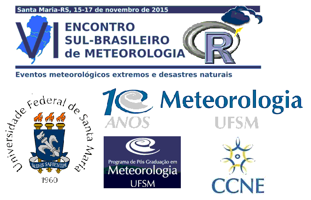

Manipulação de dados meteorológicos com R (Resbmet)
========================================================
width: 1440
height: 900
transition: none
font-family: 'Helvetica'
css: my_style.css
author: Jonatan Tatsch, UFSM
date: Santa Maria, 16, Nov de 2015

</style>

Facilitadores
=======================
 
### &nbsp;&nbsp;&nbsp;&nbsp;&nbsp;&nbsp;[Roilan Valdés (Mestrando PPGMET-UFSM)]()
 
#### &nbsp;&nbsp;&nbsp;&nbsp;&nbsp;&nbsp; Nelson Navarrete (Pós-Doc PPGMET-UFSM)
 
#### &nbsp;&nbsp;&nbsp;&nbsp;&nbsp;&nbsp; Guilherme Goergen (Doutorando PPGMET-UFSM)

Introdução
=======================
 
## Análise de dados meteorológicos 
  
 
 
> Processo pelo qual adquire-se conhecimento, compreensão e percepção dos fenômenos meteorológicos a partir de observações (dados) qualitativas e quantitativas.

 
 
 

Etapas para abordagem de um problema
=======================

 1. **Questão científica/problema**
 
 2. **Obtenção de dados:** coleta/medida do(as) estado/condições da atmosfera
    - Instrumentos e sensores
 
 3. **Tratamento de dados:**
    *download* ---> limpeza ---> formatação --->  
     transformação ---> controle de qualidade
       - ferramenta/software
         - conhecimento em programação
 
 4. **Análise de dados**
    - ferramenta/software
      - conhecimento em programação
       
 5. **Proposta de um modelo** (estatístico, empírico, físicamente baseado)
  
 6. **Apresentação/divulgação/publicação/Relatório**

Programação computacional
=======================

</style>

</style>

R
=======================
   
* Comunidade fantástica
   
* **Software Free**
   
* Código aberto
   
* Linguagem de Programação (intuitiva)
   
* **Ambiente para Análise de dados interativa**

Por que o R?
=======================
-  Acesso ao estado da arte em análise de dados
   
- Modelagem numérica, otimização
   
- Interface com Fortran, C, C++, Python
   
- Visualização de dados
   
- [Importação](https://github.com/hadley/readr) e [Manipulação de dados](http://blog.rstudio.org/2014/07/22/introducing-tidyr/)
   
- [Relatório dinâmicos](http://rmarkdown.rstudio.com/articles.html) e [interativos](http://shiny.rstudio.com/)

- **Existe grande chance de alguém já ter feito o modelo ou gráfico que você está querendo fazer**

- **Você poderá ir além, construir ou aperfeiçoar aquilo que já está livremente disponível**

Por que o R?
=======================

Ferramentas específicas para:

* dados espacias

* séries temporais

* importação e ferramentas de GIS

* leitura de dados em formatos específicos (netcdf, binários, ...)

Por que o R? 
=======================
   

(se quiser mais motivos ainda ... assista o vídeo abaixo)

RStudio
=======

[RStudio](http://www.rstudio.com/) é um ambiente de desenvolvimento integrado livre e de código aberto. 

-------------
- Para Windos, Linux e Mac
   
- ênfase da sintaxe do R, auto-preenchimento de código, identação inteligente
   
- execução do R diretamente do editor
   
- manejo de diretórios e projetos
   
- histórico de gráficos, zoom, atalhos para exportar imagens e PDF
   
- Integrado com Knitr
   
- Integrado com Git para controle de versões

Programação do curso
=======================

 
## &nbsp;&nbsp;&nbsp;&nbsp;&nbsp;&nbsp;**Introdução ao Curso**
 
## &nbsp;&nbsp;&nbsp;&nbsp;&nbsp;&nbsp;[Instalando o R e o RStudio](https://rawgit.com/jdtatsch/Resbmet/master/0_Rinstall.html)
 
## &nbsp;&nbsp;&nbsp;&nbsp;&nbsp;&nbsp;Dia 1: O Essencial sobre R
 
## &nbsp;&nbsp;&nbsp;&nbsp;&nbsp;&nbsp;Dia 2: Manipulação de dados

Material do curso
=======================
 
 
Acesse https://github.com/jdtatsch/Resbmet
